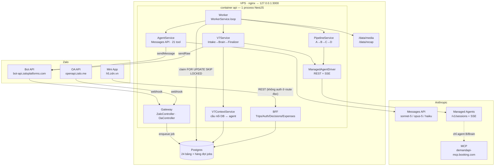
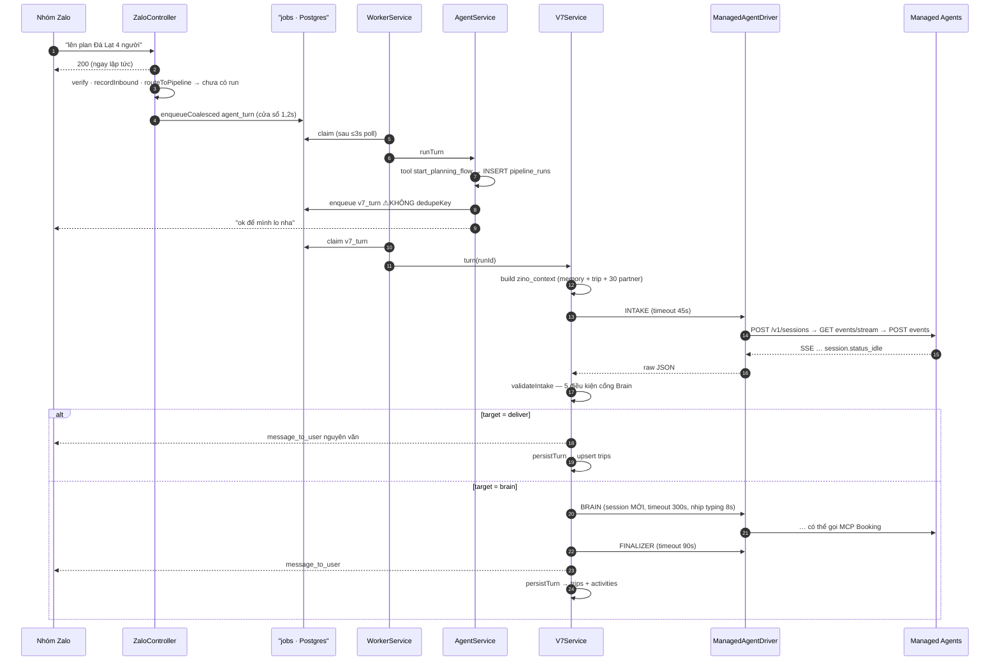
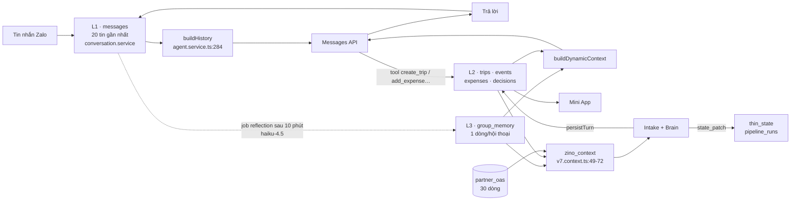

# Zino — Review kiến trúc & đề xuất tối ưu

> **Phạm vi:** toàn bộ `apps/api` + `apps/miniapp` + `infra/` + CI/CD. Ngoài phạm vi: prompt của 3 agent v7 và 4 agent v2 (nằm trên Claude Console, không có trong repo), thư mục `infra/openclaw*`.
> **Mục tiêu:** (1) rủi ro trước demo, (2) bản đồ kiến trúc, (3) cắt độ trễ & chi phí.
> **Mốc:** nhánh `main` @ `e65e850` · 29/07/2026 · cây làm việc sạch (2 file build của Mini App đang sửa dở).
> **Độ tin cậy:** Cao với đường webhook → job → agent → Zalo và toàn bộ `pipeline/`. Trung bình với `oa/` và Mini App (đọc qua subagent, có trích dẫn). Thấp với hành vi thật của 3 agent v7 — chỉ có 2 lần đo, chưa lần nào chạy trọn chuỗi trên VPS.

---

## 1. Tóm tắt

Zino là một process NestJS duy nhất đóng ba vai: gateway webhook Zalo, BFF cho Mini App, và worker chạy job nền. Hàng đợi nằm trên Postgres với `FOR UPDATE SKIP LOCKED`, và `dedupe_key = zaloChatId` là thứ đảm bảo mỗi nhóm chat chỉ có một lượt agent chạy tại một thời điểm (`jobs.service.ts:139-164`).

Điều quan trọng nhất cần nắm: **hệ thống có BA đường lên kế hoạch cùng tồn tại**, chọn bằng biến môi trường — `AgentService` (mặc định, 21 tool, Messages API), pipeline 4 agent v2 (`ZINO_PIPELINE_ENABLED=1`), và hệ ba agent v7 (`ZINO_V7_ENABLED=1`, ưu tiên cao nhất, `tools/index.ts:188-212`). Tắt cả hai cờ thì hệ thống chạy y hệt trước khi có Managed Agents — đó là đường lui trong 5 giây.

Ba rủi ro lớn nhất trước demo:

1. **Một flow v7 hỏng dai dẳng khoá cả nhóm khỏi 20 tool còn lại**, và cả hai tin lỗi đều không nói cho user biết cách thoát (`v7.types.ts:243`, `v7.service.ts:315-318`). Cửa thoát `thoát` có tồn tại (`zalo.controller.ts:236`) nhưng không ai biết; TTL dọn dẹp là 24h và **không chỉnh được qua `.env`** vì `ZINO_PIPELINE_TTL_MS` không có trong `docker-compose.yml`.
2. **Toàn bộ endpoint đọc của Mini App không có xác thực**, và `GET /trips/:id/members` trả về `zaloUserId` của mọi thành viên — chính là giá trị mà mọi endpoint ghi nhận làm danh tính (`trips.controller.ts:89`, `expenses.controller.ts:75-82`).
3. **Bảo đảm "một lượt mỗi hội thoại" của hàng đợi không thật sự được thực thi.** Lượt v7 mở flow được xếp hàng không có `dedupeKey` (`v7.tools.ts:91`, vì `ToolContext.enqueue` thiếu tham số đó — `tools/types.ts:20`), và `jobs.service.ts:145` bỏ qua guard với mọi job `dedupe_key IS NULL`. Hôm nay chưa vỡ **chỉ vì** `WorkerService.loop()` là một vòng lặp tuần tự trong một container duy nhất (`worker.service.ts:64-80`). Chạy thêm một worker — điều mà chính comment ở `:24-26` mời gọi — là hai lượt Brain chạy song song và ghi đè `thin_state` của nhau.

Điểm mạnh thật sự: mọi quyết định khó đều đã được ghi lý do ngay tại chỗ trong code, hàng đợi có backoff/reclaim/dedupe đúng bài, và cả hai kiến trúc agent đều nằm sau cờ nên có đường lui.

### Đã sửa ngay sau lượt review (29/07)

| Mục | Thay đổi | File |
|---|---|---|
| **H1** | Hai tin lỗi nay đều chỉ cách gõ `thoát`; thêm bộ đếm lỗi liên tiếp, chạm 2 là backend tự đóng flow và báo cho nhóm | `v7.types.ts`, `v7.service.ts` |
| **H3** | `ToolContext.enqueue` nhận `dedupeKey`; `start_planning_flow` và `start_trip_planning` truyền `ctx.zaloChatId` | `tools/types.ts`, `agent.service.ts`, `v7.tools.ts`, `planning.tools.ts` |
| **H6** (một phần) | Gỡ `DebugController` khỏi `app.module.ts` | `app.module.ts` |
| **M1** | `IDLE_MS` 3.000 → 500ms | `worker.service.ts` |
| **M3** | Bổ sung 10 biến vào compose, gồm `ZINO_PIPELINE_TTL_MS` và `ZINO_MANAGED_AGENTS_BETA` | `infra/docker-compose.yml` |
| **M4** | `build()` tách thành `buildForIntake` (không partner) và `buildForBrain` (đủ) | `v7.context.ts`, `v7.service.ts` |
| **M7** | Timeout cho cả ba Anthropic client (60s / 60s / 5 phút) | `agent.service.ts`, `worker.service.ts`, `merchant-agent.service.ts` |
| **M8** | Xoá session Brain của lượt trước ngay khi tạo session mới | `v7.service.ts` |
| **L2** | `sendRaw`/`sendMarkdown` trả về kết quả thật; nhắc hẹn chỉ đánh dấu `sent` khi Zalo nhận | `zalo.client.ts`, `worker.service.ts` |
| *phát sinh* | Thêm `envStr()` cạnh `envInt()`, và chuyển 8 biến chuỗi + 2 biến số sang dùng chúng | `pipeline.types.ts` + 6 file |
| **M0** | Volume Postgres đặt tên cứng, không suy ra từ project name | `infra/docker-compose.yml` |

**Về mục "phát sinh" — đáng đọc kỹ, vì suýt nữa nó phá cả bot.** Việc đưa biến vào compose dạng `${X:-}` chỉ an toàn nếu code đọc biến đó chịu được chuỗi rỗng. Bảy biến model và base URL đang đọc bằng `process.env.X ?? "mặc định"`, mà `??` chỉ bắt `null`/`undefined` — chuỗi rỗng lọt qua, và kết quả là `model: ""`, tức Anthropic từ chối **mọi** request. Hai biến khác (`ZINO_TURN_TIMEOUT_MS`, `ZINO_BATCH_WINDOW_MS`) đọc bằng `Number(... ?? default)`, cho `0` — trần lượt 0ms nghĩa là agent dừng sau vòng đầu. Đây đúng là lỗi đã mất một giờ để tìm ra đêm 28/07, chỉ khác biến.

Quy tắc rút ra, đã ghi vào docblock của `envStr` (`pipeline.types.ts`): **biến nào xuất hiện trong `docker-compose.yml` dạng `${X:-}` thì phải đọc qua `envInt` hoặc `envStr`, không bao giờ qua `??`.** Kiểm nhanh bằng lệnh:

```bash
# Liệt kê biến compose cho phép rỗng, rồi tìm chỗ nào còn đọc bằng ??
awk '/^    environment:/,/^    volumes:/' infra/docker-compose.yml \
  | grep -oE '\$\{[A-Z_0-9]+:-\}' | tr -d '${:-}' | sort -u \
  | while read v; do grep -rn "process\.env\.$v *??" apps/api/src | grep -v '?? ""'; done
```

Chưa sửa, có chủ đích: **H2** (phân quyền Mini App) quá lớn để đụng trước demo · **H4** chỉ hở ở dev local vì compose bắt buộc `AGENT_API_KEY` · **H5** cần thiết kế quản lý khoá · **M2/M5/M6** là nợ kỹ thuật, không phải rủi ro demo · siết `validateBrain` bị hoãn vì một validator chặt hơn có thể từ chối output hợp lệ đúng hôm chạy thật.

---

## 2. Phạm vi & phương pháp

Đã đọc trực tiếp: `pipeline/*` (toàn bộ), `zalo/zalo.controller.ts`, `agent/agent.service.ts`, `agent/tools/index.ts`, `agent/tools/v7.tools.ts`, `jobs/*`, `app.module.ts`, `infra/docker-compose.yml`. Đọc qua subagent có trích dẫn `file:line`: `trips/`, `auth/`, `decisions/`, `money/`, `oa/`, `media/`, `db/schema.ts`, `db/bootstrap.sql`, `.github/workflows/`, `apps/miniapp/src/lib/`.

Đã trace hai đường end-to-end: webhook → `ingest` → job → worker → agent → Zalo (cả ba chế độ cờ), và Mini App → `/auth/zalo` → session JWT → `/me/trips`.

Đã kiểm chứng bằng lệnh, không suy đoán: đối chiếu biến môi trường code đọc với khối `environment:` trong compose (kết quả ở §11 #M3), đếm tool thật trong từng file, đọc `git status`/`git log`.

Yếu nhất: hành vi runtime của 3 agent v7. Số đo duy nhất có được là hai lần chạy `spike-v7.mjs` ngày 29/07 (Intake 9–19s, một lần trả JSON bị cắt, Brain chưa lần nào chạy). Mọi con số về Brain trong tài liệu này đều là `[UNKNOWN]`.

---

## 3. Kiến trúc tổng thể

Một container `api` (Node 20) + một container `postgres`, cả hai bind loopback, nginx của BTC proxy vào (`infra/docker-compose.yml:57-58`). Không có Redis, không có message broker — hàng đợi là một bảng Postgres.

Trong process `api` có ba vai chạy song song:

- **Gateway** — `ZaloController` nhận `POST /zalo/webhook`, verify `X-Bot-Api-Secret-Token` bằng `timingSafeEqual` (`zalo.controller.ts:333-340`), trả `200` NGAY rồi xử lý nền bằng `void this.ingest(...)` (`:57`). Đây là điều bắt buộc: Zalo retry khi webhook timeout, xử lý đồng bộ nghĩa là agent chạy hai lần cho một tin.
- **BFF** — `TripsController`, `AuthController`, `DecisionsController`, `ExpensesController`, `PartnersController` phục vụ Mini App.
- **Worker** — `WorkerService.loop()` poll bảng `jobs` mỗi 1s khi bận, 3s khi rảnh (`worker.service.ts:19-20, 78`).



Mọi hộp trong sơ đồ đều là một class thật. `DRV` (`managed-agent.driver.ts`) là chỗ **duy nhất** chạm REST của Managed Agents — đổi sang SDK chỉ phải sửa ba hàm private ở cuối file (`:174-247`). `CTX` (`v7.context.ts`) là thứ doc v7 không có: nó bơm ký ức nhóm, chuyến đang hoạt động và mạng lưới OA đối tác vào payload agent, rồi ghi kết quả ngược xuống `trips`/`activities` để Mini App có cái hiển thị.

### Ba chế độ, chọn bằng cờ

Bộ tool nạp cho `AgentService` được quyết định lúc module load, một lần duy nhất (`tools/index.ts:188-212`):

| Cờ | Tool nạp | Đường lên kế hoạch |
|---|---|---|
| không cờ nào | **21** tool (9 trip + 3 money + 2 partner + 2 decision + 2 memory + 2 async + 1 reply) | `request_deep_plan` → job `deep_plan` → opus-5 + web_search |
| `ZINO_PIPELINE_ENABLED=1` | **22** tool: bỏ `request_deep_plan`, thêm `start_trip_planning` + `cancel_trip_planning` | pipeline A→B→C→D |
| `ZINO_V7_ENABLED=1` | **22** tool: bỏ `request_deep_plan`, thêm `start_planning_flow` + `cancel_planning_flow` | Intake → (deliver \| Brain → Finalizer) |

Khi v7 bật, 20 tool "thường" (22 trừ hai tool v7) là thứ nhóm mất quyền dùng nếu flow bị kẹt — xem **H1**.

`v7Enabled()` được kiểm TRƯỚC `pipelineEnabled()` nên bật cả hai thì v7 thắng. **`[FACT]`** Vì bộ tool cố định lúc load, đổi cờ bắt buộc phải restart container — không có hot-reload.

---

## 4. Bảng thành phần

| Thành phần | Đường dẫn | Trách nhiệm | Phụ thuộc chính | Ghi chú / rủi ro |
|---|---|---|---|---|
| `ZaloController` | `zalo/zalo.controller.ts` | Cổng vào duy nhất từ Zalo; verify, chuẩn hoá, tải ảnh, định tuyến | Jobs, Media, Conversation, V7, Pipeline, Auth | 340 dòng, đang gánh 4 việc; `routeToPipeline` có 3 nhánh cờ |
| `JobsService` | `jobs/jobs.service.ts` | Hàng đợi Postgres: enqueue, coalesce, claim, backoff, reclaim | Drizzle | Chốt serialize ở `:145` bị vô hiệu khi `dedupe_key` null → **H1** |
| `WorkerService` | `jobs/worker.service.ts` | Vòng lặp job; 7 loại job; nhắc hẹn; dọn run hết hạn | Agent, V7, Pipeline, Merchant, Trips | Anthropic client không timeout (`:33`) |
| `AgentService` | `agent/agent.service.ts` | Một lượt hội thoại: dựng prompt, vòng lặp tool ≤8, prompt cache | Anthropic SDK, toolMap | Trần thời gian 75s (`:17`), trần 3 ảnh (`:22`) |
| `V7Service` | `pipeline/v7.service.ts` | Orchestrator 3 agent; parse, patch state, kiểm invariant, gửi nguyên văn | Driver, V7Context, Zalo, Conversation | `ensureRun` (`:86`) là code chết → **M2** |
| `V7ContextService` | `pipeline/v7.context.ts` | Cầu nối hai chiều DB ↔ agent; upsert trip; ghi activities | Drizzle | Bơm 30 partner mỗi lượt → **M4** |
| `PipelineService` | `pipeline/pipeline.service.ts` | State machine v2 A→B→C→D | Driver | 512 dòng, mặc định tắt → **M6** |
| `ManagedAgentDriver` | `pipeline/managed-agent.driver.ts` | REST + SSE tới Managed Agents; timeout; 1 lượt sửa JSON | fetch | `request()` (`:227`) không timeout, không retry |
| `DatabaseModule` | `db/database.module.ts` | Chạy `bootstrap.sql` lúc boot; ném lỗi nếu hỏng | pg, Drizzle | `bootstrap.sql` là nguồn sự thật, không phải `schema.ts` → **M5** |
| `AuthService` | `auth/auth.service.ts` | Đăng nhập Zalo/device; mã ghép đôi; JWT tự viết | fetch graph.zalo.me | Secret rơi về `AGENT_API_KEY` (`:33`) → **H6** |
| `OaOAuthService` | `oa/oauth.service.ts` | OAuth v4 + PKCE cho OA đối tác; refresh token | fetch oauth.zaloapp.com | Token lưu plaintext → **H5** |

### 4.1 `V7Service` — orchestrator v7 (`pipeline/v7.service.ts`)

**Trách nhiệm** đúng như v7 §3.1 và không hơn: cấp ngữ cảnh, gọi agent, parse JSON, áp state patch, kiểm invariant, gửi `message_to_user` nguyên văn. Nó cố tình KHÔNG hiểu ý định và không tự viết chữ cho user.

**Luồng một lượt** (`turn()`, `:134-293`):

1. Dựng `zino_context` từ DB, nhét vào `thin_state` dưới khoá `zino_context` (`:157-161`).
2. Gọi Intake. `validateIntake` (`v7.types.ts:175-210`) ép đủ 5 điều kiện cổng Brain §6.9 — sai một điều là ném, Brain không chạy oan.
3. `route.target === "deliver"` → gửi tin, lưu trip nếu brief đủ, kết thúc (`:187-214`).
4. `route.target === "brain"` → Brain (nhịp "đang soạn tin" mỗi 8s, `:229`) → Finalizer → lưu → gửi → `persistTurn`.

**State sở hữu:** một dòng `pipeline_runs` cho mỗi hội thoại đang có flow. Partial unique index `pipeline_runs_one_active_uq` (`bootstrap.sql:261-263`) đảm bảo tối đa một run chưa kết thúc mỗi hội thoại.

**Xử lý lỗi** (`handleFailure`, `:303-324`) — ba nhánh có chủ đích khác nhau:

- `V7ValidationError` → gửi `SAFE_FALLBACK_MESSAGE`, đặt `awaiting_user`, **giữ flow sống**
- `StageTimeoutError` → gửi tin xin lỗi, `awaiting_user`, **không retry** (session vẫn chạy phía Anthropic; gọi lại là hai lượt song song)
- lỗi khác → ném lên cho `JobsService` retry với backoff

**`[FACT]` Điểm cần chú ý:** hai nhánh đầu đều giữ flow sống. Đó là quyết định đúng cho lỗi thoáng qua, nhưng với lỗi lặp lại thì nhóm bị kẹt — xem **H1**.

### 4.2 `JobsService` — chốt serialize (`jobs/jobs.service.ts`)

Truy vấn `claim()` (`:139-164`) là trái tim của tính đúng đắn. Điều kiện chọn job:

```sql
WHERE j.status = 'pending' AND j.run_at <= now
  AND ( j.dedupe_key IS NULL
        OR NOT EXISTS (SELECT 1 FROM jobs r
                       WHERE r.dedupe_key = j.dedupe_key
                         AND r.status = 'running'
                         AND r.locked_at > staleBefore) )
```

**`[FACT]`** Nhánh `j.dedupe_key IS NULL` cho phép job không khoá chạy song song với bất kỳ job nào. Đó là ý định ban đầu (job độc lập như `recap` không cần xếp hàng), nhưng nó vô hiệu hoá bảo vệ cho `v7_turn` mở flow — xem **H3**.

**`[FACT]`** Điều che khuất lỗ hổng đó: `WorkerService.loop()` (`worker.service.ts:64-80`) là một vòng `while` tuần tự — `claim()` rồi `await handle(job)` rồi ngủ. Một job tại một thời điểm, một container `api` duy nhất trong compose. Nên **hôm nay** hai lượt v7 vẫn chạy nối tiếp theo `ORDER BY run_at, id`. Bảo đảm đến từ hình dạng triển khai, không đến từ hàng đợi.

`STALE_LOCK_MS = 15 phút` (`:41`) được chọn có tính toán: phải lớn hơn tổng timeout một lượt v7 (45 + 300 + 90 = 435s), nếu không một worker thứ hai sẽ nhận lại job trong lúc Brain đang chạy.

---

## 5. Luồng dữ liệu & luồng điều khiển

### 5.1 Một lượt v7 đầy đủ



Bước 8 là chỗ **H3** nằm: job này không có `dedupeKey`. Nếu user nhắn tiếp trong lúc nó chưa chạy xong, webhook tạo một `v7_turn` **có** `dedupeKey` — nhưng hai job không chặn được nhau vì guard chỉ so `dedupe_key` với `dedupe_key`. Hôm nay chúng vẫn chạy nối tiếp, do worker là vòng lặp tuần tự một container, chứ không do hàng đợi.

### 5.2 Ba tầng bộ nhớ



**`[FACT]`** `zino_context` là dữ liệu **dẫn xuất** — dựng lại mỗi lượt và bị `stripDerived()` gỡ trước khi lưu (`v7.context.ts:135-138`). Không có bước đó thì danh sách partner bị đóng băng vào `thin_state` ở lượt đầu rồi merge đè mãi, và bảng `pipeline_runs` phình lên.

**`[FACT]`** Việc ghi lại tin của bot vào `messages` là bắt buộc, không phải tuỳ chọn (`v7.service.ts:404`). `buildHistory` cắt lịch sử tại câu trả lời cuối của Zino (`agent.service.ts:288-296`); nếu flow v7 gửi tin mà không ghi, thì khi flow kết thúc `AgentService` sẽ coi 20 tin của user là một loạt chưa xử lý và trả lời gộp một lần.

---

## 6. Phụ thuộc

### Nội bộ

`ZaloController` → {Jobs, Media, Conversation, Zalo, Pipeline, V7, Auth} — 7 phụ thuộc, cao nhất trong hệ.
`WorkerService` → {Jobs, Agent, Zalo, Conversation, Media, Merchant, Trips, Pipeline, V7} — 9 phụ thuộc. Đây là hai điểm tập trung; mọi thay đổi kiến trúc đều đi qua chúng.
`ManagedAgentDriver` không phụ thuộc gì ngoài `fetch` và `pipeline.types` — tách sạch, dễ test.

### Bên ngoài

| Gói | Phiên bản | Dùng cho | Rủi ro |
|---|---|---|---|
| `@nestjs/*` | ^11.1.0 | DI, controller, lifecycle | ổn định |
| `drizzle-orm` | ^0.45.0 | ORM | migration **không** chạy qua drizzle — xem M5 |
| `@anthropic-ai/sdk` | ^0.71.0 | Messages API | dùng `output_config.format` (`worker.service.ts:364`) — API tương đối mới |
| `pg` | ^8.22.0 | driver Postgres | ổn định |
| `zod` | ^4.4.0 | validate DTO | ổn định |
| Managed Agents REST | beta `managed-agents-2026-04-01` | 3 agent v7 + 4 agent v2 | **beta**; header hardcode qua env không có trong compose |
| MCP Booking.com | `demandapi-mcp.booking.com` | nguồn cung thật cho Offer Scout / Brain | ngoài tầm kiểm soát; chỉ agent gọi, backend không thấy |

---

## 7. Bề mặt công khai

| Nhóm | Route | Guard | Nguồn |
|---|---|---|---|
| Webhook | `POST /zalo/webhook` | `X-Bot-Api-Secret-Token`, timing-safe | `zalo.controller.ts:42, 333` |
| Webhook | `POST /oa/webhook` | `X-ZEvent-Signature` HMAC | `oa/oa.controller.ts:119, 240` |
| Vận hành | `GET /health`, `GET /zalo/info` | không | `health.controller.ts:5`, `zalo.controller.ts:303` |
| Mini App đọc | `GET /trips`, `/trips/:id/**` (12 route) | **không** | `trips.controller.ts:21, 26, 37, 48, 59, 74, 79, 84, 89, 95, 101, 113` |
| Mini App ghi | `POST /trips/**` | `AgentKeyGuard` | `trips.controller.ts:32, 43, 54, 65` |
| Phiên | `POST /auth/zalo`, `/auth/device`, `GET /me/**` | JWT tự viết | `auth.controller.ts:37, 57, 81` |
| Quyết định | `POST /decisions/:id/vote`, `/decide` | **không** — actor lấy từ body | `decisions.controller.ts:77, 83` |
| Chi phí | `POST/PATCH/DELETE /expenses/**` | membership theo id **tự khai** | `money/expenses.controller.ts:106-290` |
| Debug | `GET /debug/conversations`, `/debug/match` | **không** | `debug.controller.ts:27, 73` |

---

## 8. Tác dụng phụ & tương tác bên ngoài

| Tác dụng | Ở đâu | Loại | Ghi chú |
|---|---|---|---|
| Gửi tin Zalo Bot | `zalo/zalo.client.ts:32` | network | timeout 20s; **không xử lý 429** (`:38-43` trả `null` im lặng) |
| Gửi tin OA | `oa/oa.client.ts:65` | network | timeout 15s; lỗi trả `false`, caller không biết |
| Tải ảnh về đĩa | `media/media.service.ts:35` | network + FS | trần 12MB; có chặn path traversal (`:84-88`) |
| Ghi trang recap | `media.service.writeRecap` | FS | ghi vào volume `/data/recap`, nginx serve trực tiếp |
| Gọi Anthropic (hot path) | `agent/agent.service.ts:169` | network | `maxRetries: 2`, **không timeout request** |
| Gọi Anthropic (nền) | `worker.service.ts:209, 295, 354` | network | **không maxRetries, không timeout** |
| Gọi Managed Agents | `managed-agent.driver.ts:205` (SSE), qua `request()` `:228` (tạo/gửi/xoá session) | network | SSE có AbortController theo stage; `request()` (`:227-237`) không timeout, không retry |
| Chạy DDL lúc boot | `db/database.module.ts:47` | DB schema | `sql.raw(ddl)`, ném lỗi → container crash-loop |
| Ghi `thin_state` | `v7.service.ts:179, 245, 266` | DB | 3 lần ghi mỗi lượt Brain |
| Upsert trip từ agent | `v7.context.ts:230-259` | DB | đổi `conversations.active_trip_id` — ảnh hưởng cả `AgentService` |
| Xoá session Anthropic | `managed-agent.driver.ts:164-172` | network | lỗi bị nuốt có chủ đích |
| Đặt `sent = true` cho nhắc hẹn | `worker.service.ts:416-419` | DB | sau khi gửi; gửi lỗi vẫn đánh dấu đã gửi |

---

## 9. Điểm mạnh

**Mọi quyết định khó đều có lý do ghi ngay tại chỗ.** Không phải comment mô tả code làm gì, mà comment giải thích *vì sao không làm cách khác* — `jobs.service.ts:33-40` (vì sao 15 phút chứ không 5), `managed-agent.driver.ts:31-38` (vì sao timeout không được retry), `pipeline.types.ts:17-27` (bẫy chuỗi rỗng lúc 2h14 sáng). Đây là thứ giúp người thứ hai sửa được code này lúc 3h sáng.

**Hàng đợi làm đúng bài.** `FOR UPDATE SKIP LOCKED` (`jobs.service.ts:154`), backoff luỹ thừa (`:195`), `reclaimStale` lúc boot (`worker.service.ts:54`), và `enqueueCoalesced` có trần dời lịch để một người nhắn liên tục không giữ bot im mãi (`jobs.service.ts:85`). Với quy mô này, chọn Postgres thay vì Redis là quyết định đúng.

**Cả hai kiến trúc agent đều có đường lui thật.** Tắt cờ là hệ thống về đúng trạng thái đã chạy ổn định (`tools/index.ts:188-212`), không phải "về lý thuyết là được".

**Prompt cache được đặt đúng chỗ.** Breakpoint ở tool cuối cùng (`tools/index.ts:242-244`) gói trọn ~1.900 token định nghĩa tool, cộng khối system tĩnh (`agent.service.ts:121-126`). Log in ra số token cache đọc/ghi mỗi lượt (`:229`) nên hiệu quả kiểm chứng được, không phải tin.

**Trang recap do code dựng, không phải LLM.** `renderRecapHtml` tất định, có unit test (`trips/recap.test.ts`), khớp từng đồng với Mini App; LLM chỉ viết 2–3 câu lời tựa và lỗi ở đó bị nuốt (`worker.service.ts:326-329`). Một cú timeout giữa demo không làm mất trang tổng kết.

**Ranh giới tầng của v7 được tôn trọng.** Backend không đọc field domain, không ghép chuỗi, gửi `message_to_user` nguyên văn. Điều đó khiến việc sửa hành vi = sửa prompt trên Console, không phải deploy lại.

---

## 10. Điểm yếu

**Hai kiến trúc lên kế hoạch cùng tồn tại, tổng gần 1.000 dòng.** `pipeline.service.ts` (512 dòng) và `v7.service.ts` (476 dòng) giải quyết cùng một bài toán bằng hai cách. v2 mặc định tắt và không có kế hoạch bật lại. Mỗi thay đổi ở `ManagedAgentDriver` phải cân nhắc cả hai.

**Logic tạo run bị nhân đôi.** `V7Service.ensureRun` (`v7.service.ts:86-111`) và khối insert trong `v7.tools.ts:53-89` làm cùng một việc với cùng các giá trị mặc định. `ensureRun` **không có bất kỳ caller nào** — đã kiểm bằng grep toàn `apps/api/src`. Sửa một chỗ quên chỗ kia là chuyện sẽ xảy ra.

**`ZaloController.ingest` gánh quá nhiều.** Trong một hàm: typing, resolve hội thoại, tải ảnh, chống trùng, mã ghép đôi, sticker, định dạng lạ, định tuyến pipeline, gộp job (`:64-147`). Mỗi tính năng mới lại thêm một `if` sớm.

**`schema.ts` và `bootstrap.sql` đã lệch nhau.** Ba partial unique index (`pipeline_runs_one_active_uq`, `link_codes_active_uq`, `decisions_one_open_uq`), index `jobs_dedupe_running_idx`, và hai `ON DELETE CASCADE` chỉ tồn tại trong SQL. `schema.ts` là thứ dev đọc; `bootstrap.sql` là thứ DB thật chạy.

**`apps/api/drizzle/0000_sour_rockslide.sql` là một cái bẫy.** Nó mô tả 5 bảng theo hình dạng cũ, không bao giờ được chạy, và không được copy vào image. Ai chạy `drizzle-kit push` vì tin thư mục này sẽ phá schema production.

**Code chết đã xác minh:** `TripsService.paidPairs` (`trips.service.ts:138`), `AuthService.linkCount` (`:229`), `proposalMessage`/`reminderMessage` (`decisions/decision.message.ts:33, 89`), `GET /me/trips/:id/recap` (`auth.controller.ts:129`) — endpoint **duy nhất** có phân quyền đúng, và không ai gọi.

---

## 11. Rủi ro xếp hạng

| # | Mức | Loại | Vấn đề | Bằng chứng | Ảnh hưởng | Hướng sửa |
|---|---|---|---|---|---|---|
| **H1** | High | reliability | Flow v7 hỏng lặp lại khoá nhóm khỏi 20 tool còn lại; tin lỗi không nói cách thoát; TTL 24h không chỉnh được | `v7.service.ts:307-308, 315-319`; `v7.types.ts:243`; `pipeline.types.ts:188`; `ZINO_PIPELINE_TTL_MS` không có trong khối `environment:` của compose | Nhóm mất ghi chi phí, nhắc hẹn, đọc bill, Partner Network — có thể suốt buổi demo | Thêm câu 'Nhắn "thoát" để quay lại bình thường' vào cả hai tin; đếm lỗi liên tiếp, ≥2 thì tự `abandon` |
| **H2** | High | security | Mọi route đọc `/trips/**` không xác thực; `GET /trips` liệt kê mọi trip; `/trips/:id/members` trả `zaloUserId` | `trips.controller.ts:21, 26, 74, 89` | Bất kỳ ai cũng đọc được toàn bộ dữ liệu chuyến đi và lấy được danh tính để mạo danh ở route ghi | Bắt buộc session JWT + kiểm membership, như `auth.controller.ts:138-143` đã làm đúng |
| **H3** | High (tiềm ẩn) | bug | `v7_turn` mở flow không có `dedupeKey` → bảo đảm "một lượt mỗi hội thoại" không được hàng đợi thực thi | `tools/types.ts:20` (signature thiếu), `v7.tools.ts:91-96`, so với `zalo.controller.ts:254`; guard bị bỏ qua ở `jobs.service.ts:145` | **Chưa vỡ hôm nay** — `worker.service.ts:64-80` là vòng lặp tuần tự, một container. Chạy worker thứ hai (comment `:24-26` mời gọi) là `thin_state` ghi đè lẫn nhau, Brain chạy hai lần, vi phạm v7 §3.3 | Thêm `dedupeKey` vào `ToolContext.enqueue`, truyền `ctx.zaloChatId` — 10 phút, đóng lỗ trước khi ai đó scale |
| **H4** | High | security | `AgentKeyGuard` fail-open khi `AGENT_API_KEY` rỗng | `common/agent-key.guard.ts:13` `if (!expected) return true;` | Mất `AGENT_API_KEY` là mọi route ghi thành công khai | Đổi thành fail-closed; compose đã bắt buộc biến này (`infra/docker-compose.yml:73`) nên prod không ảnh hưởng — chỉ dev local đang hở |
| **H5** | High | security | Access/refresh token của OA đối tác lưu plaintext | `schema.ts:330-334`, ghi ở `oa/oauth.service.ts:174-185` | Một bản dump DB = mạo danh mọi merchant đã kết nối | Mã hoá ở tầng ứng dụng bằng khoá trong env |
| **H6** | High | security | `SESSION_SECRET` rơi về `AGENT_API_KEY`; `DebugController` còn sống và không có guard | `auth.service.ts:32-33`; `debug.controller.ts:17-19` (tự ghi "XOÁ FILE NÀY") + `app.module.ts:53` | Ai có agent key ký được JWT cho bất kỳ ai; `/debug/conversations` phơi id nhóm + tên thành viên ra public | Gỡ `DebugController` khỏi `app.module.ts`; tách `SESSION_SECRET` thành khoá riêng bắt buộc. *(Các file `.env` trên đĩa **không** bị commit — `.gitignore:11-13` đã chặn; đã kiểm bằng `git ls-files`.)* |
| **M1** | Medium | perf | Độ trễ nền trước khi agent bắt đầu: tối thiểu ~1,2s, trung bình ~2,7s, **xấu nhất ~4,2s** | `zalo.controller.ts:26` (cửa sổ gộp 1.200ms) rồi chờ vòng poll `worker.service.ts:20` (`IDLE_MS = 3.000`) | Hai thành phần **không cộng dồn** — job đặt `run_at = now+1200ms`, vòng poll độc lập nên phần chờ thêm phân bố đều trong [0, 3.000]ms | `IDLE_MS` → 500ms, hoặc dùng `LISTEN/NOTIFY` của Postgres |
| **M2** | Medium | maintainability | `V7Service.ensureRun` là code chết, trùng logic với `v7.tools.ts` | `v7.service.ts:86-111` không có caller | Sửa lệch giữa hai nơi tạo run | Cho `v7.tools.ts` gọi `ensureRun`, xoá khối insert trùng |
| **M3** | Medium | ops | **22** biến môi trường code có đọc nhưng **không có** trong khối `environment:` của compose | đối chiếu bằng lệnh. 16 biến đọc trực tiếp: `ANTHROPIC_API_BASE`, `DB_AUTO_MIGRATE`, `WORKER_ENABLED`, `ZALO_BOT_API_BASE`, `ZINO_ALLOWED_ACTIONS`, `ZINO_BATCH_WINDOW_MS`, `ZINO_MANAGED_AGENTS_BETA`, `ZINO_MERCHANT_MODEL`, `ZINO_MINIAPP_URL`, `ZINO_MODEL`, `ZINO_PER_ACTION_CAP`, `ZINO_PLANNER_MODEL`, `ZINO_POLICY_DRY_RUN`, `ZINO_RECAP_MODEL`, `ZINO_REFLECTION_MODEL`, `ZINO_TURN_TIMEOUT_MS`; 6 biến đọc qua `envInt`: `ZINO_PIPELINE_TTL_MS`, `ZINO_N_VARIANTS`, `ZINO_STAGE_A/B/C/D_TIMEOUT_MS` | Không tinh chỉnh được lúc chạy; Anthropic đổi header beta là phải build lại image | Thêm dòng cho các biến cần chỉnh nóng, ưu tiên `ZINO_PIPELINE_TTL_MS` và `ZINO_MANAGED_AGENTS_BETA` |
| **M4** | Medium | cost | `zino_context` (ký ức + chuyến + 30 partner) gửi vào **cả** Intake và Brain, mỗi lượt | `v7.context.ts:113-126`; `v7.service.ts:157-161` và `:236` | Token input thừa ở mọi lượt, kể cả lượt chỉ hỏi "mấy giờ" | Chỉ đưa `partner_network` cho Brain; Intake chỉ cần `group_memory` + `active_trip` |
| **M0** | **Critical** | ops | Tên volume Postgres suy ra từ project name. Repo ghi `name: zino`, VPS chạy project `lisa` → cùng một file compose trỏ vào hai volume khác nhau, và compose **tạo volume rỗng rồi khởi động Postgres trên đó mà không báo lỗi gì** | `infra/docker-compose.yml` `name: zino` + `volumes: pgdata:`; VPS dùng `lisa_pgdata` (xem `scripts/check-v7.sh:16-17` `PG_USER=lisa`) | Mất sạch hội thoại, chuyến đi, chi phí — im lặng. Suýt xảy ra 03:26 ngày 29/07, chỉ thoát vì cổng 5432 còn bị stack cũ giữ | **ĐÃ SỬA**: volume đặt tên cứng `name: ${PGDATA_VOLUME:-lisa_pgdata}`, không còn phụ thuộc project name |
| **M5** | Medium | correctness | `schema.ts` lệch `bootstrap.sql`: 3 partial unique index, 1 index, 2 cascade | `bootstrap.sql:162, 261-263, 297-298, 359-360, 364, 376-377` so với `schema.ts` | Ai regenerate migration từ `schema.ts` sẽ bỏ mất ràng buộc "một run active mỗi hội thoại" | Ghi chú rõ trong `schema.ts` rằng SQL là nguồn sự thật; xoá `drizzle/` hoặc thêm README cảnh báo |
| **M6** | Medium | maintainability | Pipeline v2 (512 dòng) không dùng nhưng vẫn build và vẫn nối dây | `pipeline.service.ts`, `app.module.ts:67`, `worker.service.ts:110-113` | Gánh nặng đọc hiểu và bảo trì | Sau demo: xoá hẳn hoặc tách sang nhánh |
| **M7** | Medium | reliability | Anthropic client ở worker và merchant không timeout, không `maxRetries` | `worker.service.ts:33`, `oa/merchant-agent.service.ts:22` | Một request treo giữ khoá job tới 15 phút | Đặt `timeout` + `maxRetries` cho cả ba client. Lưu ý `agent.service.ts:64` chỉ có `maxRetries: 2`, **không** có `timeout` — nó cũng cần sửa, không phải mẫu để noi theo |
| **M8** | Medium | cost | Session Brain rò rỉ: mỗi lượt tạo session mới, chỉ id cuối được lưu và xoá | `v7.service.ts:340` (luôn tạo mới) + `:355-357` (ghi đè id cũ), `cleanup` `:409-412` | Session cũ không bao giờ bị xoá — idle không tính tiền nhưng là rác | Lưu mảng session id, xoá session Brain ngay sau khi parse xong |
| **L1** | Low | reliability | Không xử lý HTTP 429 / `Retry-After` ở bất kỳ client Zalo nào | `zalo/zalo.client.ts:38-43`, `oa/oa.client.ts:73-76` | Gửi tin thất bại im lặng khi bị rate-limit | Đọc `Retry-After`, backoff một lần |
| **L2** | Low | correctness | Nhắc hẹn đánh dấu `sent = true` kể cả khi gửi thất bại | `worker.service.ts:415-419` | Mất nhắc hẹn không dấu vết | Chỉ đánh dấu khi `sendMarkdown` trả về thành công |
| **L3** | Low | ops | `expireStale` không báo cho nhóm và không xoá session Anthropic | `pipeline.service.ts:117-130` | Nhóm không biết flow đã bị dọn | Gửi một tin ngắn + gọi `deleteSessions` |

---

## 12. Trường hợp biên & kiểu hỏng

**Đã xử lý tốt:**

- Zalo gửi trùng webhook → `recordInbound` trả `false`, dừng (`zalo.controller.ts:84-88`)
- Hai người cùng mở flow một lúc → unique index bắt `23505`, đọc lại run của người kia (`v7.tools.ts:72-88`)
- Agent bọc JSON trong ```` ```json ```` dù prompt cấm → `parseAgentJson` bóc fence rồi thử ngoặc ngoài (`v7.types.ts:144-162`)
- JSON bị cắt giữa chừng → một lượt `COMPACT_RETRY` xin bản gọn, dùng lại session nên không phải gửi lại payload (`v7.service.ts:359-387`)
- `stop_reason` là object chứ không phải string → xử lý đúng (`managed-agent.driver.ts:304-308`)
- Worker chết giữa chừng → `reclaimStale` lúc boot (`worker.service.ts:54`)
- Tin nhắn > 2000 ký tự → `chunkMessage` với tiền tố `[i/N]` tự tính độ dài của chính nó (`zalo/render.ts:301-320`)
- Model không sinh câu trả lời nào → có tin mặc định, không im lặng (`agent.service.ts:244-247`)

**Chưa xử lý:**

- **Intake hỏng lặp lại** — H1. Không có bộ đếm lỗi liên tiếp; mỗi lượt đều thử lại từ đầu
- **Hàng đợi không thực thi bảo đảm "một lượt mỗi hội thoại"** — H3. Hiện được che bởi hình dạng triển khai
- **Postgres mất kết nối giữa lượt v7** — `save()` ném, `handleFailure` ném tiếp, job retry, nhưng agent đã chạy và đã tốn tiền
- **Zalo trả 429** — L1
- **Brain trả status bất kỳ** — `validateBrain` (`v7.types.ts:213-224`) chỉ kiểm `typeof o.status === "string"`, **không** đối chiếu với danh sách hợp lệ. `needs_user_input`, `blocked`, hay một chuỗi rác đều qua được, và `turn()` chạy thẳng sang Finalizer (`:249-255`) trong mọi trường hợp. So sánh: `validateIntake` kiểm `route.target` rất chặt (`:182-184`), còn v2 có `STAGE_STATUSES` (`pipeline.types.ts:43-48`). Đây là lỗ hổng validate rõ rệt nhất của v7
- **`persistTurn` với brief hình dạng lạ** — chỉ ghi cảnh báo rồi bỏ qua (`v7.context.ts:167`). Mini App trống trơn mà không có lỗi nào nổi lên. Cảnh báo này là có chủ đích và đúng, nhưng chỉ ai đọc log mới thấy

---

## 13. Bán kính ảnh hưởng khi sửa

**Sửa `ToolContext` (`tools/types.ts`)** → chạm 6 file `*.tools.ts` (`decision`, `money`, `partner`, `planning`, `trip`, `v7`) + `agent.service.ts:88-108`. Thêm tham số tuỳ chọn thì an toàn; đổi tham số có sẵn thì không.

**Sửa `pipeline_runs`** → `v7.service.ts`, `pipeline.service.ts`, `v7.tools.ts`, `planning.tools.ts`, `schema.ts`, `bootstrap.sql`. **Sáu chỗ**, và hai chỗ cuối phải sửa song song.

**Sửa `ManagedAgentDriver`** → cả v2 và v7. Hợp đồng ngầm: `runAgent` trả text thô, caller tự parse.

**Đổi `conversations.active_trip_id`** → `v7.context.ts:256-259` ghi, `agent.service.ts:85` đọc, `tools/trip.tools.ts` đọc/ghi. **`[FACT]`** v7 có thể đổi trip đang hoạt động ngay giữa lúc `AgentService` đang chạy một lượt khác. Hiện không đụng nhau vì worker chạy tuần tự — nhưng đây chính là thứ H3 sẽ phá vỡ nếu ai đó chạy worker thứ hai.

**Đổi số tool** → `toolsForApi()` cảnh báo `strict: true` bị API từ chối ở 16 tool (`tools/index.ts:216-231`). Hiện đang 21–22 tool, không bật strict. Thêm tool nữa vẫn được, nhưng đừng bật strict.

---

## 14. Đánh giá test

Có 10 file test, tập trung vào logic thuần: `money/settle.test.ts` (392 dòng — dày nhất), `money/expense-rules.test.ts`, `trips/recap.test.ts`, `trips/trips.dto.test.ts`, `decisions/tally.test.ts`, `decisions/decision.message.test.ts`, `pipeline/pipeline.types.test.ts`, `pipeline/v7.test.ts` (152 dòng), `auth/session.test.ts`, `miniapp/src/lib/utils.test.ts`.

**Được phủ tốt:** chia tiền, dựng recap, kiểm phiếu, parse/validate output agent, nhận diện `BẮT ĐẦU RESEARCH`, `applyStatePatch`.

**Không có test, mà lại là chỗ dễ sai nhất:**

- `JobsService.claim()` — truy vấn SQL quyết định tính đúng đắn của cả hệ. H3 là lỗi ở đúng chỗ này và không test nào bắt được.
- `V7Service.turn()` — orchestrator, chỉ có test cho các hàm thuần mà nó gọi.
- `ZaloController.routeToPipeline` — 3 nhánh cờ, không test nào.
- `V7ContextService.upsertTrip` — quyết định có tạo trip hay không.

**`[INFERENCE]`** Với deadline hackathon thì đánh đổi này hợp lý. Nhưng nếu chỉ viết được một test nữa, hãy viết cho `claim()` với hai job cùng `dedupe_key` và một job `dedupe_key IS NULL` — đó là H3, và nó đã lọt qua vì không có test nào chạm tới truy vấn này.

---

## 15. Câu hỏi mở

1. ~~`[UNKNOWN]` Brain chạy mất bao lâu?~~ **ĐÃ ĐO 29/07 09:06** — `[FACT]` Brain **155,4s**, sinh 12.556 ký tự. Cả lượt Intake→Brain→Finalizer: **167,7s**. Lượt Intake đầu tiên của một session mới mất 39,0s (dựng sandbox), các lượt sau 11–14s. Kết luận: `ZINO_BRAIN_TIMEOUT_MS = 300s` có biên gần gấp đôi, giữ nguyên; `STALE_LOCK_MS = 15 phút` vẫn lớn hơn tổng 284s worst case, giữ nguyên.
2. `[UNKNOWN]` **Brain trả `needs_user_input` thì hệ thống làm gì?** Code chạy thẳng sang Finalizer, không có nhánh riêng (`v7.service.ts:249`). Có phải hành vi mong muốn không?

2b. `[FACT]` **Hợp đồng Brain trong doc KHÔNG khớp agent thật.** §7/§10.2 quy định `draft_message_to_user` + `evidence` + `quality`; agent team dựng trả `answer_payload` + `decision_summary` (là **object**, không phải chuỗi) và không có ba field kia. Bản validate cũ vì thế vứt trọn 155 giây công việc. Đã nới `validateBrain` xuống hai điều kiện thật sự cần (có `status`, có gì đó cho Finalizer) và ghi log cảnh báo khi thiếu `evidence`/`quality` — hai thứ duy nhất cho biết Brain có tra cứu thật hay đang bịa. **Việc còn lại cho team: quyết định sửa doc theo agent, hay sửa agent theo doc.**
3. `[UNKNOWN]` **`current_brief.trip` mà Intake sinh ra có đúng hình dạng `upsertTrip` mong đợi không?** (`destinations[]` hoặc `destination`, `date_window.start/end` dạng `YYYY-MM-DD`, `budget.per_person`, `participant_count` — `v7.context.ts:213-221`). Sai tên field là Mini App trống trơn mà chỉ có một dòng `warn`.
4. `[UNKNOWN]` **`reply_contract` được dùng ở đâu ngoài việc lưu?** Nó được ghi vào `thin_state.last_reply_contract` (`v7.service.ts:263`) để lượt sau Intake hiểu "chọn 2". Chưa xác minh Intake có thật sự đọc nó không — nằm trong prompt trên Console.
5. `[UNKNOWN]` **`partner_network` Brain đọc được nhưng có đường thực thi nào không?** Không tìm thấy `send_inquiry` hay tương đương ở phía v7. Brain gợi ý được OA đối tác nhưng backend không có cách gửi lệnh đi.
6. `[ASSUMPTION]` `AGENT_API_KEY` luôn được đặt ở production (compose bắt buộc bằng `${AGENT_API_KEY:?…}`, `infra/docker-compose.yml:73`), nên H4 chỉ ảnh hưởng dev local. Cần xác nhận không ai chạy container bằng lệnh `docker run` tay.
7. `[UNKNOWN]` nginx có thêm tiền tố `/api` không, và có rate-limit ở tầng edge không. `main.ts` không đặt prefix; `zino.conf` không có `limit_req`.

---

## 16. Đề xuất theo thứ tự ưu tiên

### A. Trước demo — 4 việc, ước tính 45 phút

**A1. Sửa H1 — lối thoát cho user (10 phút, giá trị cao nhất).** Đây là rủi ro duy nhất có thể phá hỏng cả buổi demo mà không ai cứu kịp:

```ts
// v7.types.ts:243
export const SAFE_FALLBACK_MESSAGE =
  "Mình chưa xử lý trọn vẹn yêu cầu này. Bạn gửi lại tin nhắn cuối giúp mình nhé.\n" +
  'Nếu vẫn không được, nhắn "thoát" để mình quay lại bình thường.';
```

Tương tự cho tin timeout ở `v7.service.ts:317`. Nếu còn thời gian: đếm lỗi liên tiếp trong `thin_state`, ≥2 thì tự `abandon(run.id, "failed")`.

**A2. Đo Brain một lần (20 phút).** Chạy `spike-v7.mjs` với kịch bản đủ 5 lượt tới `BẮT ĐẦU RESEARCH`. Đây là số liệu duy nhất còn thiếu để chốt `ZINO_BRAIN_TIMEOUT_MS`. Nếu Brain > 300s thì phải nâng cả `STALE_LOCK_MS` (`jobs.service.ts:41`) cho khớp.

**A3. Gỡ `DebugController` (2 phút).** Xoá `DebugController` khỏi mảng `controllers` ở `app.module.ts:53`. File tự ghi "XOÁ FILE NÀY" ở `:17-19` và nó phơi id nhóm + tên thành viên ra public.

**A4. Sửa H3 (10 phút).** Không gấp bằng ba việc trên vì worker hiện chạy tuần tự, nhưng rẻ và đóng vĩnh viễn một lỗ hổng đúng lúc rảnh tay:

```ts
// tools/types.ts:20
enqueue: (kind: string, payload: Record<string, unknown>,
          runAt?: Date, dedupeKey?: string) => Promise<void>;
// agent.service.ts:102 — truyền tiếp
enqueue: async (kind, payload, runAt, dedupeKey) => {
  await this.jobs.enqueue(kind as never, payload, { runAt, dedupeKey });
}
// v7.tools.ts:91 — thêm tham số thứ tư
await ctx.enqueue("v7_turn", {...}, undefined, ctx.zaloChatId);
```

### B. Cắt độ trễ & chi phí — theo thứ tự lợi ích/công sức

**B1. `IDLE_MS: 3000 → 500` (1 dòng, `worker.service.ts:20`).** Cắt tới 2,5s khỏi câu trả lời ở trường hợp xấu, và ~1,25s tính trung bình. Chi phí: nhiều query `claim()` rỗng hơn — với một bảng có index `jobs_poll_idx` thì không đáng kể. Đây là tối ưu rẻ nhất trong toàn bộ danh sách.

**B2. Không gửi `partner_network` cho Intake (M4).** Intake chỉ cần `group_memory` + `active_trip` để không hỏi lại thứ đã biết. 30 dòng partner với `description`, `price_hint`, `deeplink` là token input thừa ở **mọi** lượt, kể cả lượt trả lời một câu hỏi vặt. Tách `build()` thành `buildForIntake()` và `buildForBrain()`.

**B3. Tinh chỉnh trên Console (không đụng code).** Ba việc theo thứ tự tác động:

- **Bỏ `normalized_request` khỏi output Intake.** Đây là nguyên nhân gốc của lần JSON bị cắt hôm 29/07 (`v7.service.ts:365-372`). Backend không đọc field này. Bỏ đi là output ngắn lại vài lần, hết cắt, và không cần lượt `COMPACT_RETRY`.
- **Hạ model/effort của Intake.** Đo được 9–19s cho một việc §6.2 mô tả là "economical model, low effort". Đây là đường mà **mọi** tin nhắn đi qua, nên mỗi giây tiết kiệm ở đây nhân với toàn bộ lưu lượng.
- **Brain: `effort: medium` + đặt trần số offer.** Đo trên Offer Scout: 87,1s tổng, trong đó cold start 3,3s, gọi MCP 2s, và **77s chỉ để sinh 9.276 ký tự JSON**. Nút thắt là sinh output, không phải nghiên cứu. Giảm số offer trả về là cách trực tiếp nhất.

**B4. Thêm `ZINO_PIPELINE_TTL_MS` và `ZINO_MANAGED_AGENTS_BETA` vào compose (M3).** Cái đầu cho phép hạ TTL xuống 1h trong ngày demo — nếu flow kẹt, tự khỏi sau một giờ thay vì một ngày. Cái sau tránh phải build lại image nếu Anthropic đổi header beta.

**B5. Đặt timeout cho Anthropic client ở worker và merchant (M7).** Một dòng mỗi chỗ, ngăn một request treo giữ khoá job 15 phút.

### C. Sau hackathon — nợ kỹ thuật

1. **Phân quyền (H2, H4, H6).** Bắt buộc session JWT ở mọi route `/trips/**`, kiểm membership từ `person_links` chứ không từ id user tự khai. Mẫu đúng đã có sẵn ở `auth.controller.ts:138-143` — và trớ trêu là endpoint duy nhất làm đúng thì Mini App không gọi. Nhân rộng nó. `AgentKeyGuard` đổi thành fail-closed.
2. **Mã hoá token OA (H5)**, tách `SESSION_SECRET` khỏi `AGENT_API_KEY`, và xoay các khoá đã lộ trong quá trình debug.
3. **Chọn một kiến trúc agent (M6).** Nếu v7 thắng thì xoá `pipeline.service.ts`, `planning.tools.ts`, 4 biến `ZINO_AGENT_A/B/C/D_ID`, và các cột `alignment_result`/`sourcing_result`/`planning_result`/`package_result` của `pipeline_runs`.
4. **Gộp đường tạo run (M2)** — cho `v7.tools.ts` gọi `V7Service.ensureRun`.
5. **Dọn `apps/api/drizzle/`** hoặc thêm README ghi rõ nó không bao giờ chạy; ghi chú trong `schema.ts` rằng `bootstrap.sql` mới là nguồn sự thật (M5).
6. **Viết test cho `JobsService.claim()`** — một test ba dòng đã đủ bắt H3.
7. **Siết `validateBrain`** — thêm danh sách status hợp lệ như `STAGE_STATUSES` của v2, và một nhánh riêng cho `needs_user_input`.
8. **Tách `ZaloController.ingest`** thành chuỗi handler, mỗi handler trả "đã xử lý / chuyển tiếp".

---

## 17. Phụ lục

### Kiểm kê file (`apps/api/src`, 12.364 dòng TypeScript)

| File | Trạng thái | Ghi chú |
|---|---|---|
| `pipeline/v7.service.ts` (476) | đọc kỹ | orchestrator v7 |
| `pipeline/managed-agent.driver.ts` (343) | đọc kỹ | REST + SSE, dùng chung v2/v7 |
| `pipeline/v7.types.ts` (244) | đọc kỹ | validator + cổng Brain §6.9 |
| `pipeline/v7.context.ts` (305) | đọc kỹ | cầu nối DB ↔ agent |
| `pipeline/pipeline.types.ts` (214) | đọc kỹ | `envInt`, timeout, TERMINAL_STATUSES |
| `pipeline/pipeline.service.ts` (512) | đọc chọn lọc | v2, mặc định tắt; đã đọc `findActive`, `expireStale`, stage C |
| `pipeline/state-patch.ts` | không đọc lượt này | đã đọc và test ở phiên trước |
| `zalo/zalo.controller.ts` (340) | đọc kỹ | gateway, 3 nhánh cờ |
| `agent/agent.service.ts` (402) | đọc kỹ | hot path, prompt cache |
| `agent/tools/index.ts` (249) | đọc kỹ | chọn bộ tool theo cờ |
| `agent/tools/v7.tools.ts` (129) | đọc kỹ | H3 nằm ở `:91` |
| `agent/tools/types.ts` | đọc chọn lọc | `ToolContext.enqueue` `:20` |
| `jobs/jobs.service.ts` (225) | đọc kỹ | hàng đợi, `claim()` |
| `jobs/worker.service.ts` (427) | đọc kỹ | 7 loại job |
| `app.module.ts` | đọc kỹ | nối dây |
| `db/schema.ts` (619) | đọc qua subagent | 24 bảng, 19 FK |
| `db/bootstrap.sql` | đọc qua subagent | DDL thật lúc boot |
| `db/database.module.ts` | đọc qua subagent | `sql.raw(ddl)` `:47` |
| `trips/*`, `auth/*`, `decisions/*`, `money/*` | đọc qua subagent | mọi route + phân quyền |
| `oa/*`, `media/*`, `zalo/zalo.client.ts`, `render.ts` | đọc qua subagent | outbound + token |
| `agent/prompt.ts`, `agent/tools/{trip,money,partner,decision,planning}.tools.ts` | chỉ đếm tool | nội dung prompt ngoài phạm vi |
| `trips/recap.ts` (544), `money/settle.ts`, `decisions/tally.ts` | không đọc | logic thuần, có unit test dày |
| `infra/docker-compose.yml` | đọc kỹ | khối `environment:` của service `api` bắt đầu ở `:65`, cảnh báo "không dùng env_file" ở `:59-64` |
| `.github/workflows/{ci,deploy-api}.yml` | đọc qua subagent | GHCR → ssh → compose pull |
| `apps/miniapp/src/**` | đọc chọn lọc | `lib/{api,session,actor,flags}.ts` |

### Thuật ngữ

- **L1 / L2 / L3** — ba tầng bộ nhớ: transcript (`messages`), dữ liệu nghiệp vụ (`trips`…), ký ức bền về nhóm (`group_memory`)
- **thin state** — state mỏng của v7, lưu ở `pipeline_runs.thin_state`, cập nhật bằng `state_patch` deep-merge
- **cổng Brain (§6.9)** — 5 điều kiện Intake phải thoả để được gọi Brain; kiểm ở `v7.types.ts:189-207`
- **deliver / brain** — hai giá trị của `route.target`; `deliver` nghĩa là Intake tự trả lời và dừng
- **dedupeKey** — khoá serialize của hàng đợi, thường là `zaloChatId`
- **v2 / v7** — pipeline 4 agent (A→B→C→D) so với hệ 3 agent (Intake→Brain→Finalizer)

### Neo tham chiếu chính

`jobs.service.ts:139-164` (claim) · `worker.service.ts:64-80` (vòng lặp tuần tự — thứ đang che H3) · `v7.service.ts:134-293` (turn) · `v7.types.ts:175-210` (cổng Brain) · `zalo.controller.ts:201-300` (định tuyến) · `tools/index.ts:188-212` (chọn bộ tool) · `managed-agent.driver.ts:255-319` (đọc SSE) · `v7.context.ts:49-72` (zino_context) · `database.module.ts:41-53` (migration lúc boot) · `infra/docker-compose.yml:59-118` (biến môi trường)

### Ghi chú về cách đọc tài liệu này

Bản nháp đầu tiên khẳng định H3 gây ra hai lượt v7 chạy song song **hôm nay**. Một lượt đối chiếu lại với `worker.service.ts:64-80` cho thấy điều đó sai: worker là vòng lặp tuần tự trong một container duy nhất, nên lỗ hổng là tiềm ẩn chứ chưa hiện thực. Cùng lượt đó sửa thêm 14 con số và trích dẫn sai khác. Mọi khẳng định còn lại trong tài liệu đã được mở file tại đúng dòng để kiểm — nhưng nếu bạn thấy chỗ nào không khớp, hãy tin code.
