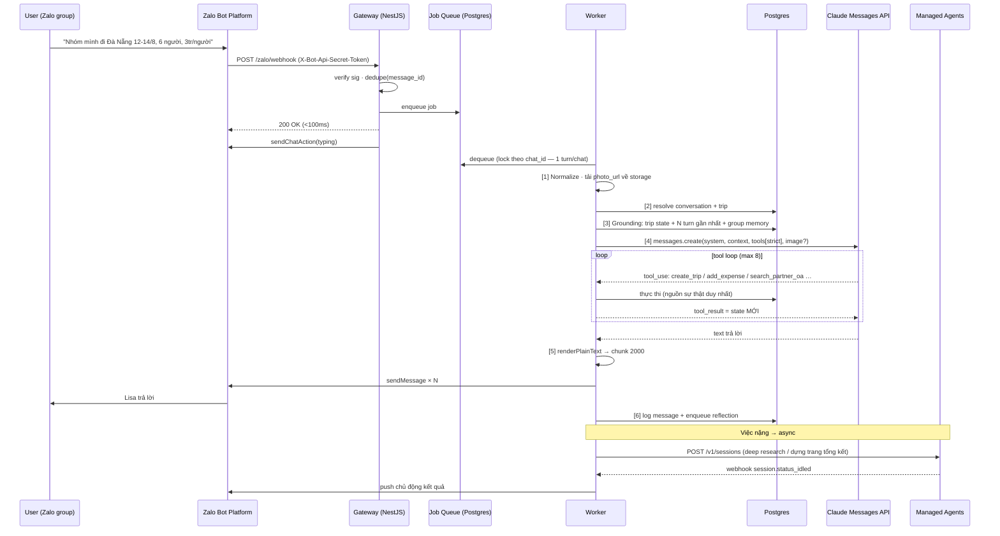
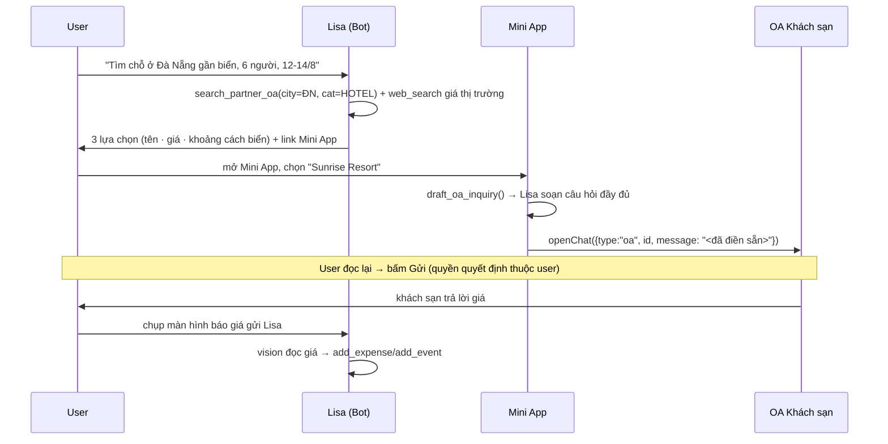

# Lisa — Kiến trúc hệ thống AI Agent du lịch trên Zalo

> Bản chốt cho ZA Hackathon 2026. Mọi ràng buộc dưới đây đã được verify từ tài liệu chính thức
> (Zalo Bot API, Zalo Mini App SDK, Zalo OA Open API, Claude Managed Agents / Messages API).
> Phần nào **chưa verify được** đều ghi rõ.

---

## 0. Tóm tắt quyết định

| Hạng mục | Chọn | Bỏ / Không dùng | Lý do |
|---|---|---|---|
| Kênh chat | **Zalo Bot API** (webhook) | OA Open API | Bot có token ngay, không cần giấy phép DN; OA test cần mã số DN + duyệt 2 ngày → không kịp |
| Bộ não hot-path | **Messages API** (Sonnet 5) + strict tools + structured output | — | Latency <3s, ép được JSON schema, streaming |
| Bộ não việc nặng | **Managed Agents** (session + sandbox + scheduled deployment) | — | Deep-research lịch trình & dựng trang tổng kết — async, có sandbox thật |
| OCR hoá đơn | **Claude vision** (đính ảnh vào turn) | Tesseract / Zalo AI OCR | Đọc hoá đơn tiếng Việt tốt hơn, 0 hạ tầng thêm |
| UI giàu | **Zalo Mini App** (zmp-sdk) | — | `openChat` prefilled chỉ có ở Mini App — đây là điểm ăn tiền |
| State | **Postgres** (Drizzle) | Vector DB | Dữ liệu chuyến đi là quan hệ, không phải semantic search. Recall bằng SQL + LLM |
| Reverse proxy | **nginx sẵn có của BTC** | Caddy | nginx đang giữ 80/443 + wildcard cert `*.123c.vn`. Đụng vào = rủi ro cert. Chỉ thêm 1 `location` block |
| Orchestration | **Tự viết** (NestJS) | OpenClaw | Cần kiểm soát pipeline ack/dedupe/serialize; OpenClaw có caveat inbound-image không ổn định |

---

## 1. Ràng buộc cứng của Zalo Bot API (đã verify)

Đây là những thứ **quyết định toàn bộ thiết kế UX**, không được quên:

| Ràng buộc | Hệ quả thiết kế |
|---|---|
| Endpoint `POST https://bot-api.zaloplatforms.com/bot<TOKEN>/<method>` | Token nằm trong path, không có header auth |
| **Chỉ plain text** — không markdown, không HTML | Phải có lớp `renderPlainText()`: markdown → text + emoji/box-drawing |
| **Tối đa 2000 ký tự/tin** | Phải chunk theo ranh giới đoạn, đánh số `[1/3]` |
| **Không có button / inline keyboard** | Dùng lựa chọn đánh số `1️⃣ 2️⃣ 3️⃣` + hiểu ngôn ngữ tự nhiên. Việc gì cần UI giàu → đẩy sang Mini App qua link |
| Inbound chỉ 4 event: `message.text.received`, `message.image.received`, `message.sticker.received`, `message.unsupported.received` | File/PDF/voice/video/location đều rơi vào `unsupported` → phải có reply lịch sự "gửi giúp mình dạng ảnh nhé" |
| **Ảnh vào là `message.photo_url` — URL trần, không cần `getFile`** | Preprocessing tải ngay về storage của mình (URL có thể hết hạn — **CHƯA VERIFY** tuổi thọ) |
| `sendPhoto` nhận **URL công khai**, không phải multipart | Ảnh ra phải host trên domain của mình (`https://<team>.123c.vn/media/...`) |
| **Không có album** — gửi nhiều ảnh = loop `sendPhoto` | Đánh caption `[1/N]` |
| `from.id` ổn định, `chat.chat_type` phân biệt group/1-1 (⚠️ field là `chat_type`, không phải `type`) | Khoá định danh an toàn |
| `sendChatAction(chat_id, "typing")` — chỉ có `typing` | Bắn ngay khi nhận webhook để che latency |
| Webhook ký bằng header **`X-Bot-Api-Secret-Token`** | Verify constant-time |
| `getUpdates` và `setWebhook` **loại trừ nhau** | Chọn webhook (VPS đã có HTTPS) |
| **Không thấy giới hạn cửa sổ 48h** như OA | ⭐ Push chủ động (nhắc lịch trình) hoạt động — **phải test thực nghiệm để chắc** |
| `can_join_groups` | ✅ **Đã kiểm tra thực tế: `true`** với bot `Bot Đông Kiếm Em` (account_type `BASIC`). Demo nhóm chạy được — cảnh báo "BASIC → false" trong tài liệu cộng đồng là SAI |

---

## 2. Sequence diagram — luồng chính



---

## 3. Pipeline 8 bước (bản hoàn thiện từ phác thảo của bạn)

Phác thảo gốc: *pre-processing → grounding → workflow calling agent → call multi-agent*.
Đúng hướng, nhưng thiếu 3 thứ sống còn: **ack sớm, idempotency, serialize theo hội thoại**.

```
[0] INGEST      verify chữ ký → dedupe(event_name+message_id) → enqueue → TRẢ 200 NGAY
                └─ Vì sao: Zalo retry nếu timeout. Xử lý đồng bộ = tin trùng + agent chạy 2 lần.

[1] NORMALIZE   map payload → InboundMessage{chatId, chatType, userId, text?, imageRef?}
                └─ Tải photo_url về /media NGAY (URL có thể hết hạn). Ảnh → base64 cho vision.

[2] RESOLVE     find-or-create conversation(chatId) + trip đang active
                └─ Đây là chỗ trả lời "đã từng gặp nhóm này chưa": conversation.seen_count, last_trip_id

[3] GROUND      lắp context: trip snapshot (JSON) + 12 turn gần nhất + group_memory (markdown)
                + thời gian hiện tại (Asia/Ho_Chi_Minh) + vai trò người nói
                └─ Grounding = nhồi SỰ THẬT vào prompt để model không bịa. Không phải RAG vector.

[4] ROUTE       fast-path (lệnh xác định: /trip, /chia-tien) vs agent-path (mặc định)
                └─ Fast-path tránh đốt token cho việc máy làm được.

[5] AGENT TURN  Messages API · strict tools · max 8 vòng tool · timeout 60s
                └─ Serialize theo chatId (advisory lock) — 2 turn song song sẽ ghi đè state.

[6] ACT         mọi thay đổi state ĐỀU qua tool. Tool trả về STATE MỚI để model xác nhận đúng.
                └─ Tool có side-effect lớn (chốt chuyến, chốt chia tiền) → cần confirm 2 bước.

[7] RENDER      markdown → plain text → chunk 2000 → sendMessage/sendPhoto
                └─ Lisa luôn nói rõ vừa làm gì ("đã lưu 3 mốc lịch trình").

[8] PERSIST     log message · ghi activity feed · enqueue reflection (trích memory dài hạn)
```

**Bất biến (invariants) — vi phạm là mất điểm "độ tin cậy":**

1. Một `chat_id` chỉ có **1 agent turn chạy tại một thời điểm** (Postgres advisory lock).
2. Agent **không bao giờ** tự khai state bằng văn bản — chỉ đọc qua `get_trip_state`, ghi qua tool.
3. Mỗi tool là **idempotent hoặc có khoá tự nhiên** (vd `add_expense` dedupe theo `(trip, title, amount, paid_by, ngày)`).
4. Tool lỗi → trả `{ok:false, error, hint}` cho model tự sửa, **không** ném exception ra user.
5. Mọi tin gửi đi đều ghi log kèm `message_id` để truy vết.

---

## 4. Kiến trúc agent — 1 orchestrator + 2 async specialist

Không làm multi-agent thật cho hot path (đắt, chậm, khó debug). Chuyên môn hoá nằm ở **nhóm tool**, không ở nhiều agent.

```
                          ┌──────────────────────────┐
                          │  LISA (orchestrator)     │
                          │  Sonnet 5 · Messages API │
                          │  hội thoại · <3s         │
                          └────────────┬─────────────┘
                                       │
        ┌──────────────┬───────────────┼───────────────┬──────────────┐
        ▼              ▼               ▼               ▼              ▼
   TRIP TOOLS     MONEY TOOLS     MEMORY TOOLS    GROUNDING      PARTNER OA
   create_trip    add_expense     remember        web_search     search_partner_oa
   get_state      settle          recall          (server tool)  draft_oa_inquiry
   add_event      list_expenses   forget          web_fetch      build_openchat_link
   add_note                                                       
   add_photo                                                      
   set_reminder                                                   

                     ── ASYNC (Managed Agents) ──
        ┌────────────────────────┐      ┌────────────────────────────┐
        │ PLANNER AGENT          │      │ RECAP AGENT                │
        │ deep research lịch     │      │ dựng trang tổng kết HTML   │
        │ trình: web_search +    │      │ trong sandbox từ ảnh/note/ │
        │ web_fetch, 30-90s      │      │ chi tiêu → publish         │
        │ → push chủ động về Bot │      │ → push link về Bot         │
        └────────────────────────┘      └────────────────────────────┘
```

**Vì sao tách async:** hai việc này mất 30–120s. Nhét vào hot path = user chờ trong im lặng.
Tách ra thì Lisa nói *"để mình research chút nha, 1 phút nữa mình gửi"* rồi **push chủ động** —
vừa đúng UX, vừa demo được năng lực "agent tự chạy nền" (Bot API không có cửa sổ 48h nên push được).

**Escalation:** câu hỏi lập kế hoạch phức tạp → Lisa gọi tool `request_deep_plan()` → tạo Managed Agents
session (Opus 5) → webhook `session.status_idled` → worker lấy kết quả → push. Đây là pattern
*Escalation* mà Anthropic khuyến nghị.

---

## 5. Bộ nhớ 3 tầng — chỗ hệ thống "tiến hoá"

| Tầng | Lưu ở | Nội dung | Vòng đời | Ai ghi |
|---|---|---|---|---|
| **L1 — Working** | `messages` | N turn gần nhất nguyên văn | theo hội thoại | Gateway |
| **L2 — Episodic** | `trips`,`events`,`expenses`,`notes`,`photos` | Sự thật có cấu trúc của chuyến đi | vĩnh viễn | Agent qua tool |
| **L3 — Semantic** | `group_memory.content` (markdown) | Sở thích bền của **nhóm**: *"thích biển, ngân sách ~2tr/người, Đông dị ứng hải sản, hay đi cuối tuần, ghét dậy sớm"* | vĩnh viễn, **xuyên chuyến đi** | Reflection job |

**Reflection loop (đây là "tiến hoá"):**

```
Sau mỗi phiên (im lặng >10 phút) HOẶC kết thúc chuyến đi
  → job đọc toàn bộ transcript + L3 hiện tại
  → Claude (Haiku, rẻ) với structured output:
      { add: [fact...], update: [{old,new}], remove: [fact...], confidence }
  → merge vào group_memory, giữ version cũ để audit
```

Lần sau nhóm quay lại: `[2] RESOLVE` thấy `seen_count > 0` → Lisa mở lời bằng
*"Lại là nhóm Đà Nẵng năm ngoái à! Lần này vẫn ưu tiên gần biển và né hải sản cho Đông nhỉ?"*
→ **khoảnh khắc ăn điểm rõ nhất trong demo.**

> Đường nâng cấp production: thay `group_memory` bằng **Claude Memory Store** (`memstore_...`,
> mount `/mnt/memory/<slug>/`, có version bất biến + redact + 2000 memories/store). Hôm nay dùng
> Postgres vì không thêm bề mặt API mới; kiến trúc giữ nguyên.

---

## 6. Database — delta so với schema hiện tại

Giữ nguyên `trips`, `members`, `events`, `expenses`, `activities`. **Thêm:**

```ts
conversations   // 1 dòng / chat Zalo — trả lời "đã từng gặp nhóm này chưa"
  id · zaloChatId(unique) · chatType(direct|group) · title
  activeTripId · seenCount · firstSeenAt · lastSeenAt

messages        // L1 — transcript
  id · conversationId · zaloMessageId(unique → idempotency)
  role(user|assistant|system) · senderZaloId · senderName
  text · imageUrl · rawEvent(jsonb) · createdAt

group_memory    // L3 — bộ nhớ tiến hoá
  id · conversationId(unique) · content(markdown) · version · updatedAt

jobs            // hàng đợi — không cần Redis
  id · kind(agent_turn|reflection|deep_plan|recap|reminder)
  payload(jsonb) · status(pending|running|done|failed)
  runAt · attempts · lastError · lockedBy · lockedAt

notes           // nhật ký hành trình
  id · tripId · authorZaloId · content · kind(note|diary|tip) · takenAt

photos          // kỷ niệm
  id · tripId · url · caption · uploaderZaloId · takenAt

expense_splits  // chia tiền chính xác
  id · expenseId · memberZaloId · shareAmount

reminders       // push chủ động
  id · tripId · conversationId · fireAt · message · sent · sentAt

partner_oas     // directory OA đối tác (team tự seed)
  id · oaId · name · category(HOTEL|TOUR|FNB|TRANSPORT) · city
  description · priceHint · deeplink(zalo.me/<oaId>) · avatarUrl
```

**`expenses` bổ sung:** `category`, `receiptPhotoUrl`, `splitMode(equal|custom)`, `createdBy`.

---

## 7. Chia tiền — thuật toán (đừng để LLM tự tính)

LLM tính số hay sai. Làm bằng code, LLM chỉ diễn giải kết quả:

```
1. net[member] = Σ đã trả − Σ phần phải chịu
2. Tách creditors (net>0) và debtors (net<0), sort giảm dần |net|
3. Greedy khớp lớn-nhất-với-lớn-nhất → số giao dịch tối thiểu
4. Làm tròn 1.000đ, dồn sai số vào giao dịch lớn nhất
5. Trả về [{from, to, amount}] + bảng chi tiết
```

Tool `settle_expenses()` trả về JSON này; Lisa chỉ việc render thành text đẹp. **Kiểm chứng bằng unit test** — có test là điểm cộng thật khi giám khảo hỏi "sao tin được con số".

---

## 8. Xử lý ảnh & OCR — không cần dịch vụ OCR

```
message.image.received
  → tải photo_url về /opt/lisa/media/<uuid>.jpg  (làm NGAY, URL có thể hết hạn)
  → phục vụ lại qua https://<team>.123c.vn/media/<uuid>.jpg  (để sendPhoto dùng được)
  → đính vào user turn dạng image content block (base64)
  → Claude vision đọc trực tiếp
```

Prompt cho Lisa nhận diện 3 loại ảnh và tự chọn hành động:

| Loại ảnh | Hành động |
|---|---|
| Hoá đơn / bill | Trích `{merchant, total, currency, date, items[]}` → `add_expense` + đính `receiptPhotoUrl` |
| Ảnh kỷ niệm | `add_photo` + caption tự sinh → vào gallery Mini App |
| Ảnh màn hình (vé máy bay, booking) | Trích chuyến bay/giờ/mã → `add_event` |

Đây là câu trả lời cho yêu cầu OCR: **Claude vision đọc hoá đơn tiếng Việt tốt hơn OCR truyền thống** vì hiểu ngữ cảnh (biết "Tổng cộng" là total, "VAT" không phải món ăn), và trả thẳng JSON có cấu trúc.

---

## 9. Tương tác hệ sinh thái Zalo OA — Concierge Handoff

**Sự thật cần biết trước:** Zalo **không có** API tìm kiếm OA, và **không có** API để server gửi tin
tới OA khác. Mọi thư viện làm được điều đó (`zca-js`, `zlapi`, `openzca`) đều giả lập tài khoản cá nhân
→ **vi phạm ToS, rủi ro khoá tài khoản** — tuyệt đối không dùng ở hackathon do chính Zalo tổ chức.

**Đường hợp lệ — 3 bước:**



**Tool `draft_oa_inquiry(oa_id, intent)`** trả về:
```json
{
  "message": "Chào shop! Nhóm mình 6 người muốn đặt 3 phòng đôi 12–14/08 (2 đêm).\nNgân sách ~2tr/đêm/phòng. Cho mình xin:\n1. Giá và loại phòng còn trống\n2. Có bao gồm ăn sáng không\n3. Chính sách hủy\nCảm ơn shop!",
  "openChatUrl": "zmp://openChat?type=oa&id=<oaId>&message=<urlencoded>",
  "fallbackDeeplink": "https://zalo.me/<oaId>"
}
```

**Fallback khi không có Mini App:** Lisa gửi thẳng đoạn tin đã soạn vào chat + link `zalo.me/<oaId>`
→ user copy-paste. Mất sự mượt, giữ được giá trị.

**Câu chốt khi pitch:** *"Zalo không có API để bot nhắn cho OA khác — và điều đó đúng, vì
nó bảo vệ user. Lisa không lách. Lisa soạn hộ bạn câu hỏi hoàn chỉnh, quyền bấm Gửi vẫn là của bạn.
Đây là human-in-the-loop đúng nghĩa."* — vừa trả lời được câu hỏi khó của giám khảo, vừa ghi điểm trust.

---

## 10. Hạ tầng trên VPS (đã scan thực tế)

VPS: Rocky Linux 9.4 · 4 vCPU · 5.6GB RAM · 35GB trống · IP `118.102.2.135` · SSH cổng **2222**
· SELinux Permissive · Docker **chưa cài** · egress tới `api.anthropic.com` OK (36ms).

⚠️ **nginx của BTC đang giữ 80/443** với wildcard cert `*.123c.vn` tại `/etc/nginx/certs/123c.vn.pem`.

**Quyết định: KHÔNG đụng vào nginx, chỉ thêm 1 file conf.** Bỏ Caddy khỏi compose hôm nay.

```
Internet :443 ──► nginx (BTC, cert *.123c.vn)
                    ├─ location /zalo/     ──► 127.0.0.1:3000   webhook
                    ├─ location /api/      ──► 127.0.0.1:3000   BFF cho Mini App
                    ├─ location /media/    ──► alias /opt/lisa/media   ảnh cho sendPhoto
                    └─ location /trip/     ──► alias /opt/lisa/recap   trang tổng kết
                                                 ▲
docker compose ──► postgres:16  (127.0.0.1:5432)  │
              └─► api (NestJS + worker)  :3000 ───┘
```

⚠️ Wildcard `*.123c.vn` chỉ phủ **1 cấp** → domain phải là `zah19-team35.123c.vn`,
**không dùng được** `api.zah19-team35.123c.vn`.

⚠️ Múi giờ VPS đang là `America/New_York` → **`timedatectl set-timezone Asia/Ho_Chi_Minh`**
trước khi làm reminder, nếu không lịch nhắc lệch 11 tiếng.

---

## 11. Kịch bản demo (5 phút, đúng 3 pha đề bài)

> **Thành phố demo: Vũng Tàu.** Lý do: `themalibuhotel` là OA THẬT đã xác thực —
> `openChat` mở được chat thật trên sân khấu. Kịch bản chỉ là lời thoại, đổi mất
> 30 giây; đi tìm OA thật ở thành phố khác mất hàng giờ. Luôn neo demo vào tài
> sản chắc chắn chạy được.

| Phút | Cảnh | Năng lực chứng minh |
|---|---|---|
| 0:00 | Add Lisa vào nhóm → *"Ơ nhóm Vũng Tàu năm ngoái! Vẫn né hải sản cho Đông chứ?"* | **Memory xuyên chuyến đi (L3)** |
| 0:30 | *"Đi Vũng Tàu 12–14/8, 6 người, 3tr/người"* → Lisa hỏi lại 2 câu → chốt → tạo chuyến | Grounding · confirm-before-commit |
| 1:00 | *"Lên lịch trình giúp"* → *"Để mình research nha"* → **60s sau tự nhắn** lịch trình 3 ngày có giá thật | **Async agent + web_search + push chủ động** |
| 2:00 | *"Tìm chỗ ở gần biển"* → ra **Khách sạn Malibu** → mở Mini App → **openChat điền sẵn câu hỏi** → bấm Gửi | ⭐ **OA ecosystem interop** |
| 2:45 | Chụp hoá đơn quán ăn gửi vào nhóm → Lisa đọc, ghi chi phí, chia đầu người | **Vision OCR + tool ghi state** |
| 3:15 | Ảnh kỷ niệm → vào gallery Mini App | Đa phương thức |
| 3:45 | *"Chia tiền"* → bảng ai nợ ai, **số giao dịch tối thiểu** | Thuật toán đúng, có unit test |
| 4:15 | *"Tổng kết chuyến đi"* → agent dựng **trang web tổng kết** → gửi link | Agent chạy nền, có sandbox |
| 4:45 | Slide **Partner Network** (`docs/PARTNER-NETWORK.md`) — code đã có trong repo | Business growth |

**Câu chốt cho phút 2:00** — chuẩn bị sẵn, vì giám khảo Zalo chắc chắn hỏi:

> *"Zalo không có API cho bot nhắn thay user — và điều đó đúng, nó bảo vệ người
> dùng. Lisa không lách. Lisa soạn hộ câu hỏi đầy đủ, quyền bấm Gửi vẫn là của
> bạn. Bước tiếp theo là Partner Network: khi khách sạn uỷ quyền OA cho Lisa,
> câu trả lời của họ tự động quay về nhóm chat — chúng em đã implement, đang chờ
> đối tác uỷ quyền."*

---

## 12. Đánh giá trung thực — làm hết trong 1 ngày?

**Phần tôi làm được hôm nay (~15h code, tôi chạy song song nhiều luồng):**

| # | Hạng mục | Ước tính |
|---|---|---|
| 1 | Bootstrap VPS: docker, timezone, nginx conf, compose | 45p |
| 2 | Zalo Bot gateway: verify sig, dedupe, queue, ack, typing | 1h |
| 3 | Mở rộng schema + migration | 45p |
| 4 | Worker + advisory lock + vòng lặp tool | 1h30 |
| 5 | 16 tool (trip/money/memory/partner/reminder) | 2h30 |
| 6 | Vision pipeline (tải ảnh, phân loại, trích xuất) | 45p |
| 7 | `renderPlainText` + chunk 2000 + gửi ảnh | 45p |
| 8 | Memory L3 + reflection job | 1h |
| 9 | Thuật toán chia tiền + unit test | 45p |
| 10 | Reminder scheduler + push chủ động | 45p |
| 11 | Managed Agents: planner + recap website | 1h30 |
| 12 | Mini App: itinerary/expenses/gallery/recap + **openChat** | 2h |
| 13 | Seed 20 partner OA + deploy + E2E + kịch bản demo | 1h30 |

**4 việc CHỈ BẠN làm được — làm ngay bây giờ, song song với tôi:**

| Việc | Thời gian | Chặn cái gì | Rủi ro |
|---|---|---|---|
| **A. Chạy `getMe`** với bot token, xem `can_join_groups` | 2 phút | Toàn bộ demo nhóm | 🔴 Nếu `false` → phải chuyển demo sang chat 1-1. **Kiểm tra ĐẦU TIÊN** |
| **B. Xác nhận domain team** (`zah19-team35.123c.vn`?) + SSH key vào VPS cổng 2222 | 15 phút | Deploy, webhook, media | 🟡 |
| **C. Zalo Mini App**: app đã đăng ký chưa, `zmp` token còn hạn không | 30 phút | Hạng mục 12 + openChat | 🔴 Nếu chưa có app → 2–4h thủ tục tôi không làm hộ được → **rơi mất điểm ăn tiền nhất** |
| **D. Anthropic API key** + xin quyền Managed Agents beta | 20 phút | Hạng mục 11 | 🟡 Beta có thể phải điền form chờ duyệt → nếu không kịp, Planner/Recap chạy bằng Messages API thường (mất chữ "Managed Agents" nhưng demo y hệt) |

**Kết luận thẳng:**

- **Hạng mục 1–10 + 13: chắc chắn xong hôm nay.** Đây đã là một sản phẩm hoàn chỉnh cả 3 pha.
- **Hạng mục 12 (Mini App): phụ thuộc C.** Nếu app Zalo Mini App đã sẵn sàng → xong. Nếu chưa → tôi làm fallback bằng Bot (Lisa gửi text đã soạn + deeplink `zalo.me`) và một trang web thường cho recap. Mất độ mượt, **không mất luồng**.
- **Hạng mục 11 (Managed Agents): phụ thuộc D.** Không có beta → dùng Messages API + background job, kết quả với người xem là như nhau.

**Việc duy nhất tôi khuyên cắt nếu kẹt giờ:** trang recap dựng-bằng-sandbox (11) → thay bằng template HTML tĩnh render từ DB. Tiết kiệm 1h30, khán giả gần như không phân biệt được.

👉 **Bạn làm A ngay bây giờ** (2 phút) và báo tôi kết quả — nó quyết định kịch bản demo. Trong lúc đó tôi bắt đầu từ hạng mục 1.
