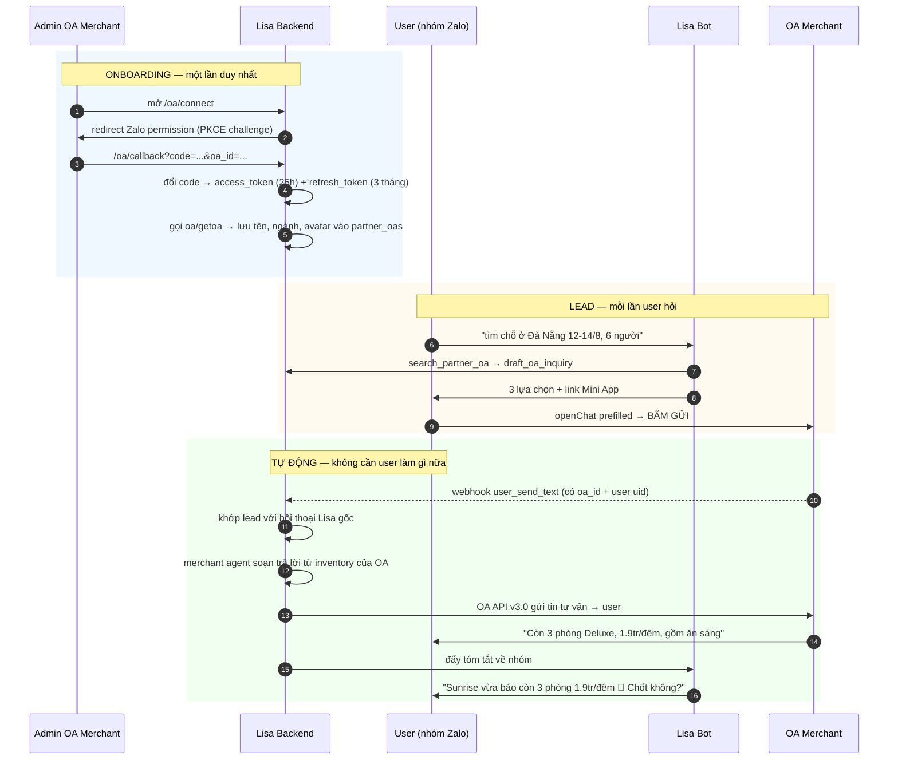

# Lisa Partner Network — vòng lặp khép kín, hợp lệ 100%

> Cách để agent "hỏi OA và nhận được câu trả lời" mà **không** đụng tới zca-js.

---

## 1. Mắt xích bị bỏ sót

Nghiên cứu trước kết luận đúng hai điều:

- Zalo **không có** API để server gửi tin tới OA khác
- `openChat` prefilled là đường hợp lệ duy nhất — nhưng **user phải bấm Gửi**

Chỗ ai cũng dừng lại: *"user bấm Gửi rồi thì sao? Lisa đâu biết OA trả lời gì."*

**Nhưng nếu OA đối tác đã uỷ quyền cho app của Lisa** thì tin nhắn user vừa gửi
sẽ rơi thẳng vào **webhook của chính chúng ta**. Từ đó ta trả lời thay merchant,
và đẩy kết quả ngược về nhóm chat của Lisa.

Vòng lặp khép kín. User chỉ bấm Gửi đúng một lần — phần còn lại tự động.

> Cơ sở pháp lý kỹ thuật: tài liệu Zalo ghi rõ *"Một Ứng dụng có thể thay mặt
> **nhiều OA** thực hiện gửi tin nhắn"*, thông qua OAuth v4 + PKCE.

---

## 2. Sequence



---

## 3. Vì sao hợp lệ

| Bước | Cơ chế | Căn cứ |
|---|---|---|
| Merchant uỷ quyền | OAuth v4 + PKCE | API chính thức, có màn hình đồng ý |
| Nhận tin user gửi OA | Webhook OA | Chỉ nhận của OA đã uỷ quyền cho app |
| Trả lời user | Tin Tư vấn qua OA API v3.0 | User vừa nhắn → cửa sổ tư vấn mở, miễn phí |
| Đẩy về nhóm Lisa | Zalo Bot API | Bot của chính mình |

Không có bước nào giả lập tài khoản cá nhân. Không dùng thư viện unofficial.
Mỗi tin gửi đi đều có **uỷ quyền tường minh** từ chủ sở hữu OA.

---

## 4. Vì sao câu chuyện business mạnh hơn

| | zca-js | Partner Network |
|---|---|---|
| Thông điệp | "chúng em lách được" | "chúng em xây mạng lưới đối tác" |
| Với Zalo | khai thác kẽ hở | **làm hệ sinh thái lớn lên** |
| Merchant nhận được | không gì | AI trực 24/7 trả lời lead tức thì |
| Khoảnh khắc demo | không dám khoe | mời giám khảo bấm "Cho phép", OA hiện ngay trên màn hình |
| Rủi ro | ban tài khoản, loại thi | không |

Với merchant, đây là giá trị thật: OA du lịch thường trả lời lead sau nhiều giờ.
Lisa trả lời trong 3 giây, bằng dữ liệu chính merchant cung cấp.

---

## 5. Thành phần

```
apps/api/src/oa/
  oauth.service.ts      PKCE, đổi code→token, auto-refresh trước hạn 25h
  oa.client.ts          OA Open API v3.0 — gửi tin tư vấn, lấy thông tin OA
  oa.controller.ts      /oa/connect · /oa/callback · /oa/webhook
  merchant-agent.ts     soạn trả lời thay merchant từ inventory_note
```

**Bảng mới:**

```
oauth_states     state(pk) · code_verifier · created_at     -- PKCE, TTL 10 phút
oa_leads         partner_oa_id · oa_user_id · conversation_id · trip_id
                 last_user_message · last_reply · status · timestamps
```

**`partner_oas` bổ sung:**

```
connected · access_token · refresh_token · token_expires_at
connected_at · auto_reply · inventory_note
```

`inventory_note` là phần merchant tự khai lúc onboarding — bảng giá, loại phòng,
chính sách huỷ. Merchant agent chỉ trả lời **trong phạm vi** dữ liệu này, không bịa.

---

## 6. Ràng buộc cần nhớ

| Ràng buộc | Số | Hệ quả |
|---|---|---|
| `access_token` OA | **25 giờ** | phải auto-refresh, không phải 1 giờ như tài liệu cũ ghi nhầm |
| `refresh_token` | 3 tháng, **dùng 1 lần** | mỗi lần refresh trả token mới, mất là phải uỷ quyền lại |
| `authorization_code` | 10 phút, 1 lần | callback phải đổi ngay |
| `code_verifier` | **đúng 43 ký tự**, khác nhau mỗi request | sinh ngẫu nhiên, lưu theo `state` |
| Cửa sổ tin tư vấn | user tương tác trong **7 ngày** | trả lời lead luôn nằm trong cửa sổ |
| Rate limit OA API | 4.000 req/phút/app | thừa sức |

---

## 7. Phạm vi cho hackathon

Không kịp mời merchant thật uỷ quyền trong hôm nay. Cách demo trung thực:

**Team tự tạo một OA đóng vai "Sunrise Resort"** rồi bấm uỷ quyền ngay trên sân khấu
— đó chính là luồng production thật, chỉ khác ở chỗ OA do team sở hữu.

Khi pitch **nói thẳng**: *"OA merchant này do team dựng để demo. Luồng uỷ quyền là
luồng thật — bất kỳ OA nào bấm Cho phép cũng gia nhập mạng lưới y hệt."*

Giám khảo Zalo chắc chắn sẽ hỏi. Trả lời thẳng trước khi bị hỏi luôn tốt hơn.
