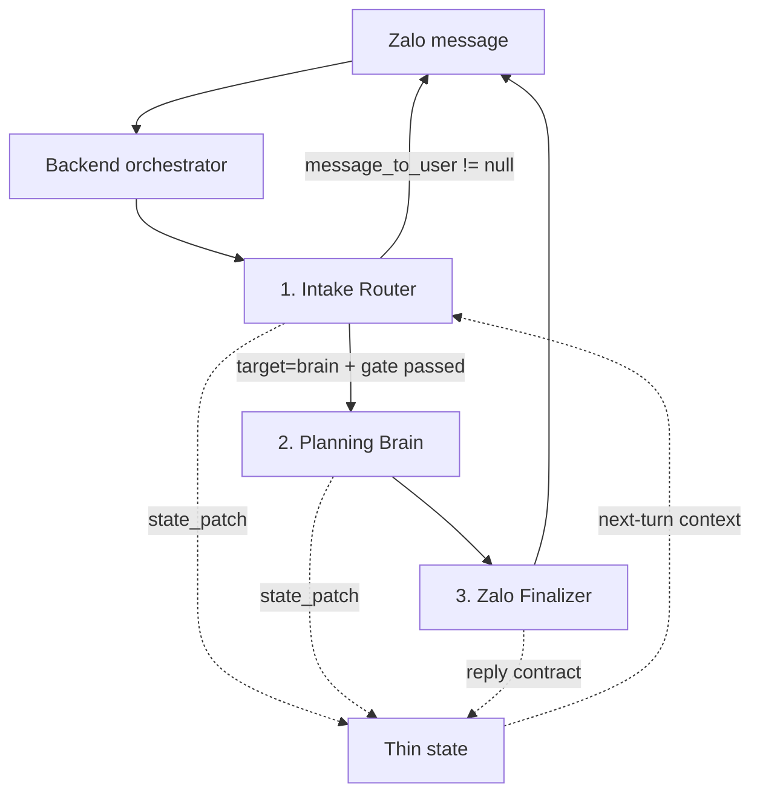

# ZA Hackathon 2026 — Agent System v7 Integration Handoff

**Document version:** 7.1  
**Canonical as of:** 29/07/2026, Asia/Ho_Chi_Minh  
**Audience:** Backend developer, AI/agent integrator, technical reviewer  
**Purpose:** A standalone context window and implementation contract for the latest three-agent system.

---

## 0. Authority and reading order

This file is the canonical handoff for the current hackathon implementation.

If older files conflict with this document, use this priority:

1. This v7.1 handoff.
2. `intake_router_v7_minimum_brief.json`.
3. `planning_brain` and `zalo_finalizer` from v6, interpreted with the v7 group-confirmation semantics in this document.
4. Older v2–v6 README files, prompts, skills, and diagrams only as historical references.

The following older concepts are deprecated:

- Owner identification as a blocker before research.
- Backend verification that the person confirming is the request owner.
- Casual confirmation such as `ok`, `xác nhận`, or `làm đi`.
- Intake trying to fill every field in the schema.
- Routing any destination/service keyword directly to Brain.
- A full orchestration skill attached to Brain at runtime.
- Custom tools requiring a backend `custom_tool_use` / `custom_tool_result` loop.
- `presentation_payload`, cards, sections, or backend-built user-facing text.
- Brain claiming that a booking, payment, message, or calendar write succeeded without a real connector result.

One legacy field remains:

```text
handoff.owner_confirmation
```

It is kept only for backward compatibility. In v7, it means **group research confirmation**, not verified owner authorization.

---

## 1. Product context

### 1.1 Hackathon

- Program: ZA Hackathon 2026.
- Theme: Agentic AI in the Zalo ecosystem.
- Chosen track: Ecosystem Innovation Agent, with Business Growth impact.
- Product surface: a conversational agent living in the Zalo ecosystem.
- Technical constraints: small infrastructure, external model APIs, no model training, no production customer data, no PII, and no dependency on real social-graph data.
- Current schedule in the original project source:
  - Submission: 09:00, 30/07/2026.
  - Voting: 03/08–07/08/2026.
  - Demo Day: 03/08/2026.
  - Award ceremony: 10/08/2026.

The source document previously said 21/07 was “today”; that wording is obsolete. The canonical date of this handoff is 29/07/2026.

### 1.2 Product thesis

The product is not “AI that writes a travel itinerary faster.”

The long-term product is an **outcome agent for shopping and services**:

> A user expresses a need in natural language; the agent clarifies the intended outcome, researches across fragmented providers, compares real trade-offs, coordinates the decision, and prepares the next action with minimal user effort.

Travel is the beachhead because it naturally demonstrates:

- Multi-constraint intent.
- Group preferences.
- Fragmented supply.
- Current prices and availability.
- Multi-step research.
- Comparison and decision support.
- A future path to inquiry, booking, payment, calendar, and expense splitting.

The architecture must remain generalizable to other services such as dining, beauty, events, healthcare discovery, home services, and local commerce.

### 1.3 User value

The Level-3 value is not only speed. The user can reach an outcome that was previously impractical because it required:

- Translating a vague need into a workable brief.
- Searching across multiple provider surfaces.
- Re-entering the same constraints repeatedly.
- Reading inconsistent and unstructured information.
- Comparing offers with different inclusions and exclusions.
- Coordinating a group decision.
- Re-planning when one constraint changes.

The agent compresses this fragmented process into one continuous conversation.

### 1.4 Business and ecosystem value

The business impact thesis is:

> Flatten the path between demand and supply, so businesses compete on their ability to satisfy a need—not only on winning narrow attention windows such as SEO, ads, branding, or placement.

Potential value:

- Convert conversational demand into high-intent commercial opportunities.
- Keep discovery and decision traffic inside the Zalo ecosystem.
- Move from monetizing attention toward monetizing outcomes, qualified leads, or transactions.
- Give businesses an additional demand surface beyond search ranking and brand recall.
- Structure demand signals that providers can respond to.
- Serve mass-market needs first; rare or unique demand is upside, not the core business case.

### 1.5 Why this must be agentic

The use case passes the “why an agent?” test because it has several of these properties:

1. The action space is open and cannot be fully enumerated with rules.
2. Preferences and constraints are individual and context-dependent.
3. The task requires multiple adaptive turns.
4. The hardest input is semantic and social context, not a fixed form.
5. Current facts, provider information, and trade-offs must be gathered and re-evaluated.

The demo should prove that the system does more than chat:

- Intake turns an ambiguous need into a decision-ready brief.
- Brain performs bounded research and produces grounded options.
- The group can refine, select, or change scope through natural messages.
- The system does not over-research casual conversation.

---

## 2. Canonical product decisions

These decisions are final for the hackathon version.

### 2.1 Three logical agents

The system has exactly three logical agents:

1. `intake_router`
2. `planning_brain`
3. `zalo_finalizer`

The backend orchestrates them. The agents do not call one another directly.

### 2.2 Every new user message enters through Intake

All new messages go to `intake_router`, including messages after research has completed.

The backend must not classify a user message semantically by itself and send it directly to Brain.

Intake uses the latest message plus thin state to decide whether the message is:

- A new request.
- A workflow reply.
- A selection.
- A confirmation.
- A follow-up inside the confirmed scope.
- A material scope change.
- A brainstorm.
- A cancellation.
- An unrelated request.

### 2.3 Brainstorm stays in Intake

Casual or exploratory messages do not justify a Brain run.

Examples:

```text
Bali mùa hè
Đi Đà Lạt
Spa cuối tuần
```

These are ambiguous seeds, not automatically planning requests.

Intake asks whether the user wants:

- A quick answer.
- Brainstorming.
- A complete plan/research deliverable.

If the user chooses brainstorming, Intake provides 3–5 short directions without web research.

### 2.4 Minimum viable brief, not schema completeness

Intake does not fill every field.

`brief_complete=true` means:

> The fields that could materially change the requested deliverable or block a required tool are known.

It does not mean every schema field is non-null.

Unknown non-blockers remain `null` or empty arrays. They may become declared assumptions or research unknowns.

### 2.5 Group research confirmation

When the minimum viable brief is complete, Intake:

1. Summarizes the scope.
2. Separates confirmed facts, assumptions, and important unknowns.
3. Requests the exact phrase:

```text
BẮT ĐẦU RESEARCH
```

Any group member may send this phrase.

The trigger is accepted only when the normalized message:

- Is trimmed.
- Ignores capitalization.
- May ignore final punctuation.
- Otherwise equals `BẮT ĐẦU RESEARCH`.

Do not accept:

```text
ok
ừ
xác nhận
làm đi
triển khai đi
```

This is intentionally prompt-level and lightweight for the hackathon. There is no backend owner validation.

### 2.6 Research confirmation is not action authorization

`BẮT ĐẦU RESEARCH` authorizes a bounded planning/research run only.

It does not authorize:

- Booking.
- Payment.
- Cancellation.
- Sending an inquiry or message.
- Writing to a calendar.
- Any other consequential external action.

The current hackathon version should prepare next steps or deep links, not claim external execution.

### 2.7 Brain is self-contained

The canonical Brain uses Managed Agent built-in tools:

- `web_search`
- `web_fetch`
- `bash`

It has:

- No attached orchestration skill.
- No custom research tool.
- No backend custom-tool result loop.

The Brain prompt contains all runtime instructions it needs.

### 2.8 Booking.com capability is optional

A Booking.com/Demand API MCP may be added to Brain as an optional extension if trusted credentials and a reliable MCP server exist.

For the hackathon, expose read-only capabilities only:

- Search properties.
- Read details.
- Check date-specific availability.
- Check price and cancellation policy.
- Return a deep link.

Do not expose:

- Create reservation.
- Payment.
- Modify reservation.
- Cancel reservation.

If the MCP is absent, Brain uses web research and clearly marks live availability or exact price as unverified when necessary.

### 2.9 Finalizer owns no new knowledge

Finalizer:

- Receives the whole Brain result.
- Fact-locks the response.
- Formats one plain-text Zalo message.
- Adds no new fact.
- Performs no search.
- Performs no planning.
- Does not recalculate money.
- Does not change the recommendation.

---

## 3. System architecture



### 3.1 Runtime boundary

The backend is responsible only for:

- Supplying message context.
- Calling agents.
- Parsing JSON.
- Applying state patches.
- Enforcing simple routing invariants.
- Sending `message_to_user` unchanged.

The backend is not responsible for:

- Understanding user intent.
- Writing user-facing prose.
- Building presentation sections.
- Performing Brain web research.
- Executing custom tool calls for the canonical version.
- Determining which follow-up stays inside scope.

### 3.2 Minimum backend flow

```js
async function handleZaloMessage({
  conversationId,
  userMessage,
  referenceTime,
  actor
}) {
  const thinState = await loadThinState(conversationId);

  const intake = parseAgentJson(await callAgent("intake_router", {
    user_message: userMessage,
    reference_time: referenceTime,
    actor,
    thin_state: thinState
  }));

  validateIntake(intake);
  await applyStatePatch(conversationId, intake.state_patch);

  if (intake.route.target === "deliver") {
    if (typeof intake.message_to_user !== "string" ||
        intake.message_to_user.length === 0) {
      throw new Error("Intake deliver route requires message_to_user");
    }

    await sendToZalo(conversationId, intake.message_to_user);
    return;
  }

  const brainReady =
    intake.route.target === "brain" &&
    intake.handoff.brief_complete === true &&
    Array.isArray(intake.handoff.missing_blockers) &&
    intake.handoff.missing_blockers.length === 0 &&
    intake.handoff.owner_confirmation === "confirmed" &&
    typeof intake.handoff.scope_summary === "string" &&
    intake.handoff.scope_summary.length > 0 &&
    intake.message_to_user === null;

  if (!brainReady) {
    throw new Error("Invalid Brain handoff");
  }

  const latestState = await loadThinState(conversationId);

  const brain = parseAgentJson(await runManagedAgent("planning_brain", {
    intake_result: intake,
    thin_state: latestState
  }));

  validateBrain(brain);
  await applyStatePatch(conversationId, brain.state_patch);

  const final = parseAgentJson(await callAgent("zalo_finalizer", {
    brain_result: brain
  }));

  validateFinalizer(final);
  await applyStatePatch(conversationId, final.state_patch);
  await saveReplyContract(conversationId, final.reply_contract);
  await sendToZalo(conversationId, final.message_to_user);
}
```

`parseAgentJson` should:

- Parse the agent response as one JSON object.
- Reject code fences or prose outside JSON.
- Validate the required top-level fields.
- Never repair business semantics silently.

Do not manually replace escaped line breaks. `JSON.parse()` already converts `\n` to real line breaks.

### 3.3 Concurrency for the hackathon

The preferred minimal implementation is to process one conversation sequentially.

If the messaging layer can deliver a second message while Brain is still running:

- Queue it at the conversation-processing layer if this already exists.
- Process it through Intake after the current Brain + Finalizer run.
- Do not start a second Brain run for the same conversation in parallel.

Do not build a complex distributed job system solely for the demo.

### 3.4 State patch semantics

Agents return partial patches, not a full replacement state.

The backend should deep-merge objects while replacing arrays supplied by a patch.

Recommended rule:

```text
object + object → recursive merge
array in patch → replace existing array
scalar in patch → replace existing scalar
explicit null in patch → clear the field
missing field → preserve existing value
```

---

## 4. Conversation state machine

### 4.1 Canonical stages

```text
idle
→ brainstorming
→ intake_gathering
→ awaiting_group_confirmation
→ brain_ready
→ research_running
→ awaiting_followup
→ selected
→ action_prepared
→ completed
→ cancelled
```

Not every flow uses every stage.

### 4.2 Routing matrix

| Current situation | User message | Intake target | Confirmation |
|---|---|---:|---|
| No active flow | Ambiguous seed | `deliver` | Not required |
| No active flow | Brainstorm request | `deliver` | Not required |
| No active flow | Complete plan request but missing blockers | `deliver` | Not requested |
| Gathering | Supplies requested facts | `deliver` or `brain` | Depends on readiness |
| Brief complete | No trigger yet | `deliver` | Pending |
| Awaiting confirmation | Exact `BẮT ĐẦU RESEARCH` | `brain` | Confirmed |
| Awaiting confirmation | `ok` / `xác nhận` | `deliver` | Still pending |
| Research completed | “Phương án 2 gần biển không?” | `brain` | Reuse confirmed scope |
| Research completed | “Chọn phương án 2” | `brain` | Reuse confirmed scope |
| Research completed | “Vì sao chọn phương án 1?” | `brain` | Reuse confirmed scope |
| Research completed | “Brainstorm thêm kiểu chill” | `deliver` | Not required |
| Research completed | “Đổi budget còn 10 triệu” | `deliver` | Reset to pending |
| Any active flow | “Thôi dừng” | `deliver` | Cancel flow |
| Any active flow | Unrelated request | `deliver` or new flow | Intake decides |

### 4.3 Confirmed scope is not permanent

Group confirmation is bound conceptually to the current scope.

A follow-up may go directly to Brain when it:

- Asks about an existing option.
- Selects an existing option.
- Requests an explanation.
- Requests a minor transformation that does not change research materially.

Confirmation must be requested again when the user materially changes:

- Destination.
- Exact date or duration.
- Budget.
- Participant count or room setup.
- Core outcome.
- Hard constraint.
- Required live-search capability.

### 4.4 Scope version

For a minimal hackathon implementation, `scope_version` is recommended but not mandatory.

If implemented:

- Increment it whenever a material blocker or scope field changes.
- Treat a previous confirmation as applying only to the version it confirmed.
- Store the current version in `active_flow.scope_version`.

This can be done entirely through state patches; it does not require owner identity logic.

---

## 5. Thin state contract

Persist only state needed to interpret the next message.

Recommended shape:

```json
{
  "active_flow": {
    "flow_id": "trip_bali_01",
    "type": "trip",
    "stage": "awaiting_followup",
    "research_status": "completed",
    "scope_version": 1
  },
  "current_brief": {
    "goal": "string|null",
    "mode": "dm|group",
    "trip": {},
    "split_bill": {}
  },
  "handoff": {
    "deliverable_type": "reference_plan",
    "brief_complete": true,
    "missing_blockers": [],
    "declared_assumptions": [],
    "confirmation_type": "group_research",
    "owner_confirmation": "confirmed",
    "scope_summary": "string"
  },
  "options": [
    {
      "option_id": "option_01",
      "visible_label": "1",
      "summary": "string"
    }
  ],
  "selected_option": null,
  "last_decision_summary": "string|null",
  "last_reply_contract": {
    "expected_type": "option_selection",
    "valid_values": ["1", "2"],
    "examples": ["Chọn 1"],
    "expires_with_flow_stage": "awaiting_followup"
  }
}
```

Do not persist:

- Chain-of-thought.
- Full model transcripts.
- Raw hidden prompts.
- Secrets or provider credentials.
- Large source-page contents.
- PII not required by the demo.

The `owner` object may remain null in the current version.

---

## 6. Agent 1 — `intake_router`

### 6.1 Mission

Turn the latest message plus thin state into one of two outcomes:

1. A complete direct response in `message_to_user`; or
2. A validated handoff to Brain.

Intake protects Brain from unnecessary or premature research.

### 6.2 Model profile

- Economical model.
- Low reasoning effort.
- No tools.
- No web access.
- No attached skills.

The deployed model ID is an application choice. The current config used `claude-haiku-4-5-20251001`, but integrators should use an available equivalent rather than treating this string as a protocol requirement.

### 6.3 Input

```json
{
  "user_message": "string",
  "reference_time": "ISO8601",
  "actor": {
    "id": "string|null",
    "name": "string|null",
    "role": "string|null"
  },
  "thin_state": {}
}
```

Intake must prioritize:

1. Active flow.
2. Current brief.
3. Last reply contract.
4. Latest message in isolation.

### 6.4 Responsibilities

- Detect brainstorm, plan, quick QA, split bill, action, or unknown mode.
- Treat a destination/service keyword as an ambiguous seed unless an outcome is clear.
- Merge only facts the user stated.
- Preserve unknown values.
- Separate hard constraints, soft preferences, and vetoes.
- Infer the requested deliverable type.
- Determine blockers based on that deliverable.
- Ask at most three high-information questions per turn.
- Continue asking on later turns only if real blockers remain.
- Summarize scope when the minimum brief is complete.
- Request exact group research confirmation.
- Route in-scope follow-ups and selections back to Brain.
- Reset confirmation after a material scope change.
- Respond directly to brainstorms and stable quick answers.

### 6.5 Prohibited behavior

- Web research.
- Current price, availability, policy, or weather claims.
- Detailed itinerary generation.
- Complex arithmetic.
- External actions.
- Owner identification as a research blocker.
- Asking for exact dates when the deliverable does not need live search.
- Trying to fill every schema field.
- Routing casual `ok` or `xác nhận` to Brain.
- Returning cards, sections, UI schemas, or prose outside JSON.

### 6.6 Deliverable types and blockers

#### `ideation`

- Brainstorm only.
- No Brain handoff.
- No group confirmation.

#### `reference_plan`

Required:

- Destination, area, or service category.
- Duration or date window sufficient to infer duration.
- Participant count or group size.
- At least one main outcome, style, or preference.

Conditional:

- Origin only when transport/route is part of the deliverable.
- Budget only when the user expects costs.

#### `costed_plan`

Required:

- All applicable `reference_plan` blockers.
- Origin when transport is included.
- Budget amount or stance: `saving`, `balanced`, `comfortable`, or `open`.
- Any user-mentioned hard constraint that materially affects the result.

`open` is a valid budget answer. Do not keep asking for a number.

#### `live_search`

Required:

- Destination or area.
- Exact start and end dates.
- Participant count.
- Room setup, occupancy, or quantity if the provider requires it.
- Budget amount, budget stance, or `open`.
- Availability-related hard constraints.

#### `action_ready`

Required:

- Inputs required by the real action tool, if such a tool exists.
- The selected outcome or item.

Research confirmation is still not action authorization.

#### `split_bill`

Required:

- Participants.
- Expense amounts.
- Who paid.
- Split rule or enough information to ask for it.

Missing money values are unknown, not zero.

### 6.7 Confirmation compatibility

Use:

```json
{
  "confirmation_type": "group_research",
  "owner_confirmation": "pending|confirmed|not_required"
}
```

Semantics:

- `pending`: waiting for exact group trigger.
- `confirmed`: any member sent the exact trigger.
- `not_required`: brainstorm or direct answer.

The `owner` field should remain null and is never a blocker.

### 6.8 Output contract

```json
{
  "status": "delivered|gathering|brainstorming|awaiting_owner_confirmation|ready_for_brain|cancelled|blocked",
  "route": {
    "interaction_type": "new_request|workflow_reply|selection|confirmation|cancellation|follow_up",
    "primary_intent": "trip|split_bill|quick_qa|action_command|other",
    "request_mode": "brainstorm|plan|quick_qa|split_bill|action|unknown",
    "target": "deliver|brain",
    "brain_effort": "high|xhigh|null",
    "confidence": 0.0,
    "reason_code": "string"
  },
  "normalized_request": {
    "goal": "string|null",
    "mode": "dm|group",
    "actor": {
      "id": "string|null",
      "name": "string|null",
      "role": "payer|member|null"
    },
    "trip": {
      "origin": "string|null",
      "destinations": [],
      "date_window": {
        "start": "YYYY-MM-DD|null",
        "end": "YYYY-MM-DD|null",
        "raw_value": "string|null"
      },
      "participant_count": null,
      "room_setup": "string|null",
      "budget": {
        "per_person": null,
        "total": null,
        "currency": "VND",
        "stance": "saving|balanced|comfortable|open|null",
        "hard": false
      },
      "shopping_slots": [],
      "hard_constraints": [],
      "soft_preferences": [],
      "vetoes": []
    },
    "split_bill": {
      "enabled": false,
      "currency": "VND",
      "participants": [],
      "expenses_raw": [],
      "rule_raw": "string|null"
    },
    "question": "string|null",
    "workflow_reply": {
      "flow_id": "string|null",
      "expected_type": "string|null",
      "resolved_value": "string|null"
    }
  },
  "handoff": {
    "deliverable_type": "ideation|reference_plan|costed_plan|live_search|action_ready|split_bill|null",
    "brief_complete": false,
    "missing_blockers": [],
    "declared_assumptions": [],
    "owner": {
      "id": null,
      "name": null,
      "role": null
    },
    "confirmation_type": "group_research|not_required",
    "owner_confirmation": "not_required|not_requested|pending|confirmed|rejected",
    "scope_summary": "string|null"
  },
  "state_patch": {},
  "message_to_user": "string|null"
}
```

### 6.9 Output invariants

```text
route.target = deliver
→ message_to_user must be a non-empty string

route.target = brain
→ message_to_user must be null
→ brief_complete must be true
→ missing_blockers must be []
→ owner_confirmation must be confirmed
→ scope_summary must be non-empty
```

The legacy status `awaiting_owner_confirmation` and stage of the same name may remain for compatibility. Product semantics are still group confirmation.

---

## 7. Agent 2 — `planning_brain`

### 7.1 Mission

After a valid Intake handoff, Brain:

1. Builds the smallest useful research plan.
2. Uses built-in tools for current facts and deterministic calculations.
3. Produces grounded options or an answer.
4. Stores only stable mappings needed for the next turn.
5. Writes one complete draft message for Finalizer.

### 7.2 Model profile

- Strongest available reasoning model.
- High effort by default; xhigh only for genuinely complex multi-constraint cases.
- Built-in tools:
  - `web_search`
  - `web_fetch`
  - `bash`
- No attached skill.
- No custom tool in the canonical build.

The current config used `claude-opus-5`; model selection is owned by the application.

### 7.3 Input

```json
{
  "intake_result": {},
  "thin_state": {}
}
```

Brain receives the complete Intake result.

### 7.4 Defensive gate

Before any tool call, Brain checks:

```text
route.target = brain
brief_complete = true
missing_blockers = []
owner_confirmation = confirmed
scope_summary != null
```

In v7, `owner_confirmation=confirmed` means the group research trigger was received.

If any precondition fails:

- Do not call any tool.
- Return `needs_user_input`.
- Ask for the request to return to Intake.

### 7.5 Research policy

Per turn:

- At most 3 independent research questions.
- At most 4 web searches.
- At most 4 web fetches.
- At most 2 bash calls.
- At most 1 retry for a failed research question, only when the query can be materially fixed.

Stop when:

- Evidence is sufficient for the confirmed scope; or
- More calls are unlikely to change the recommendation.

If a fact cannot be verified within the budget:

- Mark it unknown.
- Do not search indefinitely.

Do not expand into visa, weather, policy, attractions, routes, or prices unless the confirmed scope or a deciding constraint requires them.

### 7.6 Evidence policy

Brain must distinguish:

- User-provided facts.
- Current sourced facts.
- Calculations.
- Inference.
- Recommendation.
- Unknowns.

For changeable facts:

- Prefer official/primary sources.
- Use marketplaces/aggregators for offers when needed.
- Record a source reference.
- Record the observation time when useful.
- Do not infer exact current price, route time, or availability without evidence.

### 7.7 Option policy

- Produce two options when a real trade-off exists.
- Never produce more than three.
- Options must differ in a meaningful dimension.
- Recommend at most one option.
- Do not recommend an option that fails the quality gate.

Each user-facing option should cover:

- Main outcome or itinerary.
- Known cost.
- Unknown/excluded cost.
- Strength.
- Trade-off.
- What the user needs to decide or verify.

### 7.8 Money and split bill

Use `bash` for:

- Addition.
- Allocation.
- Per-person cost.
- Settlement.
- Consistency checks.

Never:

- Treat unknown costs as zero.
- Include unknown costs in `known_total`.
- Calculate a complex split mentally.

Split-bill output must include:

- Recorded total.
- Share per person.
- Who transfers to whom.
- A reconciliation check.

### 7.9 Action boundary

Without a real connector, Brain may:

- Prepare a shortlist.
- Prepare an inquiry.
- Prepare booking inputs.
- Return a deep link.
- State the next action.

It may not claim it:

- Booked.
- Paid.
- Cancelled.
- Sent a message.
- Added a calendar event.

If a read-only Booking.com MCP is enabled, it is a research capability, not an execution capability.

### 7.10 Output contract

```json
{
  "status": "needs_user_input|ready_for_finalizer|blocked",
  "response_kind": "question|quick_answer|trip_options|trip_selection|split_bill|action_plan|error",
  "decision_summary": "string",
  "state_patch": {
    "active_flow": {},
    "options": [],
    "actions": [],
    "reply_contract": {}
  },
  "draft_message_to_user": "string",
  "evidence": [
    {
      "source_ref": "string",
      "display_name": "string",
      "source_type": "official|web|marketplace|calculation|user_input",
      "observed_at": "ISO8601|null",
      "url": "string|null",
      "supports": [],
      "confidence": 0.0
    }
  ],
  "quality": {
    "scope": "pass|warn|fail",
    "grounding": "pass|warn|fail",
    "constraints": "pass|warn|fail",
    "arithmetic": "pass|warn|fail|not_applicable",
    "feasibility": "pass|warn|fail|not_applicable",
    "safety": "pass|warn|fail",
    "open_issues": []
  }
}
```

### 7.11 State patch rules

`options` stores stable reply mappings only:

```json
{
  "option_id": "option_01",
  "visible_label": "1",
  "summary": "short summary"
}
```

`actions` stores prepared next steps, not execution claims.

`reply_contract` must match the final reply instruction in the draft.

After a successful first research run, Brain should normally patch:

```json
{
  "active_flow": {
    "stage": "awaiting_followup",
    "research_status": "completed"
  },
  "options": [],
  "reply_contract": {}
}
```

### 7.12 Draft requirements

`draft_message_to_user` must already be a complete Zalo-ready string:

- One string.
- Plain text.
- Blank lines between sections.
- `1.`, `2.`, `3.` for choices.
- `•` for bullets.
- No table.
- No code fence.
- No raw JSON.
- No raw technical ID.
- No card/button language.
- Exactly one easy reply instruction at the end.

Partial cost wording:

```text
Đã tính: ...; chưa gồm: ...
```

---

## 8. Agent 3 — `zalo_finalizer`

### 8.1 Mission

Validate and polish the complete Brain result into exactly one final Zalo message while preserving all facts and decisions.

### 8.2 Model profile

- Balanced/economical model.
- Low effort.
- No tools.
- No web access.
- No attached skills.

The current config used `claude-sonnet-5`; model selection is owned by the application.

### 8.3 Input

```json
{
  "brain_result": {}
}
```

Finalizer receives the entire Brain result, not only the draft.

### 8.4 Responsibilities

- Check the draft against evidence, quality, and state.
- Preserve facts, dates, prices, uncertainty, recommendation, and action limitations.
- Keep a compliant draft mostly unchanged.
- Produce one `message_to_user`.
- Produce a reply contract matching the final instruction.
- Block a materially unsupported response.

### 8.5 Prohibited behavior

- Search.
- Planning.
- New facts.
- New calculations.
- Recalculation of money.
- Changing the recommended option.
- Turning unknown into zero.
- Hiding uncertainty.
- Claiming external action success.
- Returning UI structures.

### 8.6 Blocking rule

Return `blocked` when, for example:

- `quality.scope=fail`.
- The draft materially contradicts evidence.
- A core fact is presented as certain when evidence says unknown.
- The draft claims an action succeeded without connector evidence.

The blocked message should be short and should not invent a replacement answer.

### 8.7 Output contract

```json
{
  "status": "ready|blocked",
  "message_to_user": "string",
  "reply_contract": {
    "expected_type": "free_text|option_selection|confirmation|expense_input|none",
    "valid_values": [],
    "examples": [],
    "expires_with_flow_stage": "string|null"
  },
  "state_patch": {}
}
```

### 8.8 Formatting rules

- Lead with the result.
- Use blank lines between sections.
- Use numbered choices.
- Use `•` bullets.
- Limit each option to six bullets.
- Mark only one recommendation with `⭐ Đề xuất`.
- Keep unknowns explicit.
- End with exactly one easy-to-type reply instruction.
- Never say “bấm”.

---

## 9. End-to-end examples

### 9.1 Ambiguous seed

User:

```text
Bali mùa hè
```

Expected:

```text
User → Intake → deliver → User
```

Intake asks whether the user wants a quick answer, brainstorming, or a complete plan.

No Brain call. No research.

### 9.2 Brainstorm

User:

```text
Brainstorm vài kiểu trip Bali mùa hè đi.
```

Expected:

- Intake returns 3–5 directions.
- `deliverable_type=ideation`.
- `owner_confirmation=not_required`.
- No Brain call.

### 9.3 Plan with incomplete brief

User:

```text
Lên kế hoạch Đà Lạt tháng sau cho 8 người.
```

If a costed plan is implied, Intake should ask the highest-value blockers:

```text
1. Nhóm xuất phát từ đâu?
2. Muốn đi khoảng ngày nào và trong mấy ngày?
3. Ngân sách muốn theo hướng tiết kiệm, cân bằng hay thoải mái — hoặc khoảng bao nhiêu/người?
```

It should not ask who the owner is.

It should not require exact dates unless live availability/price is requested.

### 9.4 Brief complete, waiting for group trigger

User supplies:

```text
TP.HCM, 3 ngày 2 đêm, ngân sách cân bằng.
```

Expected Intake state:

```json
{
  "status": "awaiting_owner_confirmation",
  "route": {
    "target": "deliver"
  },
  "handoff": {
    "brief_complete": true,
    "missing_blockers": [],
    "confirmation_type": "group_research",
    "owner_confirmation": "pending",
    "scope_summary": "non-empty"
  },
  "message_to_user": "Scope summary ending with exact trigger instruction"
}
```

### 9.5 Exact group trigger

Any member:

```text
BẮT ĐẦU RESEARCH
```

Expected:

```json
{
  "status": "ready_for_brain",
  "route": {
    "interaction_type": "confirmation",
    "target": "brain"
  },
  "handoff": {
    "brief_complete": true,
    "missing_blockers": [],
    "confirmation_type": "group_research",
    "owner_confirmation": "confirmed",
    "scope_summary": "non-empty"
  },
  "message_to_user": null
}
```

Backend calls Brain, then Finalizer.

### 9.6 Casual confirmation is rejected

User:

```text
Ok làm đi
```

Expected:

- Intake returns `deliver`.
- Confirmation remains pending.
- Intake reminds the group to send exact `BẮT ĐẦU RESEARCH`.

### 9.7 In-scope follow-up

State:

```text
research_status=completed
stage=awaiting_followup
options=[option_01, option_02]
```

User:

```text
Phương án 2 có gần biển không?
```

Expected:

- Every message still enters Intake.
- Intake identifies `follow_up`.
- It routes to Brain without requesting the trigger again.
- Brain answers within the confirmed scope and researches only if needed.
- Finalizer returns the message.

### 9.8 Selection

User:

```text
Chọn 2
```

Expected:

- Intake resolves against stored options/reply contract.
- Brain receives the stable option mapping.
- Brain does not infer from transcript order if state conflicts.
- No new group research trigger is needed.

### 9.9 Material scope change

User:

```text
Đổi ngân sách còn 10 triệu/người nhé.
```

Expected:

- Intake updates the brief.
- Confirmation resets to `pending`.
- Scope summary is regenerated.
- Intake asks for `BẮT ĐẦU RESEARCH` again.
- Brain does not run yet.

### 9.10 Live hotel search

User wants current hotel price and availability.

Minimum blocker set includes:

- Destination/area.
- Exact dates.
- Participant count.
- Occupancy or room setup.
- Budget stance or amount.
- Relevant hard constraints.

With Booking MCP:

- Brain checks live availability, total price, room type, and cancellation policy.
- It returns two or three grounded options.
- It may return deep links.
- It does not create a reservation.

Without Booking MCP:

- Brain may find public offers.
- Exact live availability must be marked unverified if it cannot be confirmed.

### 9.11 Defensive Brain gate

If Brain receives:

```text
owner_confirmation != confirmed
```

Expected:

- No tool calls.
- `status=needs_user_input`.
- Draft asks the request to return to Intake for completion/confirmation.

---

## 10. Validation and failure handling

### 10.1 Intake validator

Reject the result when:

- Output is not one valid JSON object.
- `route.target` is missing.
- `target=deliver` but `message_to_user` is null/empty.
- `target=brain` but `message_to_user` is not null.
- `target=brain` but the Brain gate is incomplete.
- `missing_blockers` is not an array.

### 10.2 Brain validator

Reject or route to an error response when:

- Output is not valid JSON.
- `draft_message_to_user` is missing.
- `evidence` or `quality` is missing.
- A tool call is still pending.
- The output contains a claim of external action success without connector evidence.

### 10.3 Finalizer validator

Reject when:

- `message_to_user` is missing.
- `reply_contract` is missing.
- Output contains prose outside JSON.

### 10.4 Safe fallback

On malformed agent output:

- Log the raw output internally.
- Do not expose hidden prompt/tool details.
- Do not silently route to another agent.
- Return a short user-facing retry message.

Example:

```text
Mình chưa xử lý trọn vẹn yêu cầu này. Bạn gửi lại tin nhắn cuối giúp mình nhé.
```

### 10.5 Observability

Recommended event fields:

```json
{
  "conversation_id": "string",
  "flow_id": "string|null",
  "scope_version": 1,
  "agent": "intake_router|planning_brain|zalo_finalizer",
  "route_target": "deliver|brain|null",
  "reason_code": "string|null",
  "status": "string",
  "latency_ms": 0,
  "tool_calls": 0,
  "search_calls": 0,
  "fetch_calls": 0,
  "parse_success": true,
  "quality_scope": "pass|warn|fail|null",
  "quality_grounding": "pass|warn|fail|null",
  "timestamp": "ISO8601"
}
```

Do not log secrets, hidden chain-of-thought, or unnecessary user PII.

---

## 11. Integration checklist

### Backend

- [ ] Every user message calls Intake first.
- [ ] Thin state is passed into Intake.
- [ ] State patches are applied.
- [ ] `deliver` sends Intake text unchanged.
- [ ] Brain gate validates all required conditions.
- [ ] Brain runs as a Managed Agent with built-in tools.
- [ ] There is no custom tool result loop in the canonical path.
- [ ] Full Brain result is passed to Finalizer.
- [ ] Finalizer text is sent unchanged.
- [ ] Reply contract is persisted.
- [ ] Same-conversation Brain runs are not parallel.

### Intake

- [ ] Ambiguous seeds do not trigger Brain.
- [ ] Brainstorm remains in Intake.
- [ ] Blockers are deliverable-specific.
- [ ] At most three questions are asked per turn.
- [ ] Owner identification is never a blocker.
- [ ] Exact dates block only live-search cases.
- [ ] `open` budget is accepted.
- [ ] Only exact `BẮT ĐẦU RESEARCH` confirms.
- [ ] In-scope follow-ups may return to Brain.
- [ ] Material scope changes reset confirmation.

### Brain

- [ ] Defensive gate runs before tools.
- [ ] Research budget is bounded.
- [ ] Search stops when more calls will not change the choice.
- [ ] Current facts are sourced or marked unknown.
- [ ] Money uses deterministic calculation.
- [ ] Options contain real trade-offs.
- [ ] No external action is falsely claimed.
- [ ] State stores stable option IDs.

### Finalizer

- [ ] No tools.
- [ ] No new facts.
- [ ] No recalculation.
- [ ] One complete plain-text message.
- [ ] Reply contract matches the final instruction.
- [ ] Unsupported drafts are blocked.

### Optional Booking MCP

- [ ] Trusted official/API-backed source.
- [ ] Search/read only.
- [ ] No reservation creation.
- [ ] No payment.
- [ ] No cancellation.
- [ ] Exact dates and occupancy required before live search.

---

## 12. Acceptance test set

At minimum, run these cases:

1. `Bali mùa hè`
2. `Brainstorm vài kiểu trip Bali mùa hè`
3. `Lên plan Bali cho 4 người`
4. A complete brief that should ask for group confirmation
5. Exact `BẮT ĐẦU RESEARCH`
6. Casual `ok làm đi`
7. Exact trigger sent by a non-owner group member
8. Scope change after confirmation
9. In-scope option question
10. `Chọn 2`
11. Unrelated message during an active flow
12. Cancellation
13. Live hotel search missing exact dates
14. Live hotel search with exact dates and room setup
15. Brain called directly with an invalid gate
16. Brain cannot verify a current fact within research budget
17. Split bill with a missing amount
18. Finalizer receives a draft contradicting evidence

The system passes only if:

- No unnecessary Brain run occurs.
- No infinite research loop occurs.
- No custom tool remains waiting for a backend result.
- No unknown is converted into a fact or zero.
- No consequential action is falsely claimed.
- Every final response is valid Zalo plain text.

---

## 13. Non-goals for the hackathon build

Do not expand scope into:

- Production-grade identity or role authorization.
- Verified request-owner confirmation.
- Autonomous booking/payment/cancellation.
- A distributed workflow engine.
- Full provider onboarding.
- Production social-graph inference.
- Long-term transcript storage.
- Training a custom model.
- A general UI renderer for cards/sections.

The build should prove the product loop:

```text
Need
→ clarify
→ confirm research scope
→ bounded research
→ grounded decision
→ natural follow-up
```

---

## 14. One-paragraph context for another AI

You are integrating a three-agent Zalo outcome-planning system for ZA Hackathon 2026. Every new message first enters a tool-free Intake Router. Intake handles casual conversation and brainstorming itself, collects only the minimum viable brief required by the requested deliverable, and never tries to fill every schema field. When the brief is ready, it summarizes the scope and waits for any group member to send the exact phrase `BẮT ĐẦU RESEARCH`; the legacy field `owner_confirmation=confirmed` represents this group research trigger and is not verified owner authorization. The backend then calls a self-contained Planning Brain that uses only Managed Agent built-in web search, web fetch, and bash, follows a bounded research budget, produces sourced options and stable state mappings, and never claims unsupported external actions. The complete Brain result is passed to a tool-free Zalo Finalizer, which fact-locks it and returns one plain-text message. All later messages still pass through Intake; in-scope follow-ups and selections may go directly back to Brain, while material changes reset the group confirmation. Booking.com MCP is optional and read-only; booking, payment, cancellation, sending, and calendar writes are outside the canonical hackathon capability.

